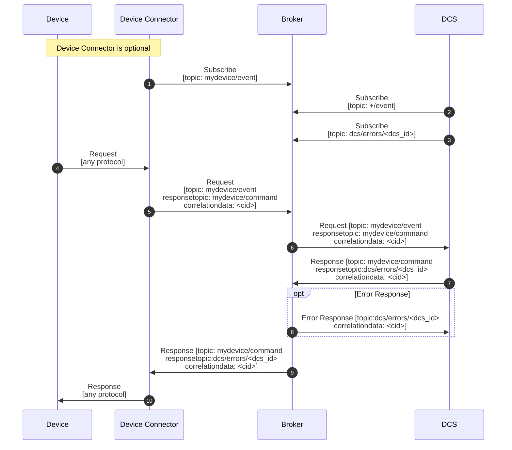
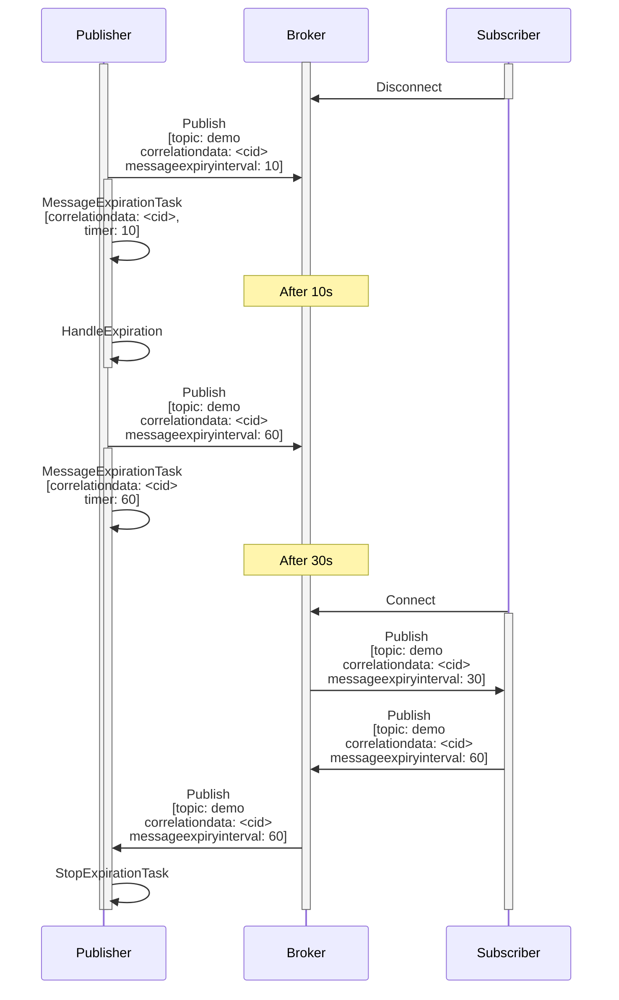

# micro-dcs

MicroDCS: An Open-Standard Framework for Distributed Sequence Control.

## Features

* Transport protocols: MQTTv5 RPC/CloudEvents & MessagePack-RPC over TCP/CloudEvents
* High-availability, horizontal scalability leveraging MQTTv5 shared subscriptions
* Deduplication of messages with at least once delivery guaranties and flow control with expiry intervals
* Generic handling of JSON/MessagePack payloads via content type
* De-/serialization to Python dataclasses with handling of custom user properties
* Multiple CloudEventProcessors handling incoming requests
* ...
* OpenTelemetry auto instrumentation plus manual instrumentation of internals (logging, metrics and tracing)

## Overall Design

Build OT apps based on open standards like MQTTv5, CloudEvents, OpenTelemetry, OPC UA companions specs, ... to apply the speed of software to the mostly hardware-defined OT base.

### Design Goals

* Manufacturing control/OT apps should be buildable like IT applications with cloud native/modern architecture principles
* Code is generated as much as possible from standard specs (e.g. OPC UA) to lower the burden to adhere to these standards

### Premises

* Event driven architecture via MQTT as transport protocol (no OPC UA Client/Server or Pub/Sub)
* OPC UA information models/companion specs are used for communication over MQTT
* Meta information is transported via MQTT user properties/cloud event headers to identify the message payload
* Implementations must only work via the generated dataclasses and not directly with the MQTT payloads (they are decoded/encoded in the background)
* There is an app UNS that has at least subtopics for `data` (variable publication/maybe setting), `events` and `command` (method calls); optionally `meta`to publish what is offered by the app in a retained topic

## Technical Standards

### MQTTv5

Standard: https://docs.oasis-open.org/mqtt/mqtt/v5.0/mqtt-v5.0.html

#### [Request / Response](https://docs.oasis-open.org/mqtt/mqtt/v5.0/os/mqtt-v5.0-os.html#_Toc3901252)

MQTTv5 supports request/response interaction with `Response Topic` and `Correlation Data`. The `Request Response Information`/`Response Information` is not standardized besides the communication channel and e.g. mosquitto supports the attributes in the communication but does not do anything with it (this means the app itself needs to create a client instance specific id and subscribe to it on startup for providing the error backchannel). Published messages to a topic are required to have a subscriber to it (this means PUBACK=0x00).

#### [Message Expiry Interval](https://www.emqx.com/en/blog/mqtt-message-expiry-interval)

MQTTv5 introduced `Message Expiry Interval` to allow the publisher to set the expiry interval for time-sensitive message and (implicitly) gain back control in message flow after expiration. Either the server already discards the message before delivering to a subscriber or the reciever discards the message based on the set interval.

#### [Shared Subscriptions](https://docs.oasis-open.org/mqtt/mqtt/v5.0/os/mqtt-v5.0-os.html#_Toc3901250)

In order to achieve high availabiliy or to increase capacity via multiple container instances/MQTT clients the MQTTv5 Shared Subscriptions can be used. A Shared Subscription is identified using a special style of Topic Filter. The format of this filter is: `$share/{ShareName}/{filter}`.

* `$share` is a literal string that marks the Topic Filter as being a Shared Subscription Topic Filter.
* `{ShareName}` is a character string that does not include "/", "+" or "#"
* `{filter}` The remainder of the string has the same syntax and semantics as a Topic Filter in a non-shared subscription.

MQTT shared subscriptions with QoS 1 offer load balancing, ensuring each message goes to only one client in the shared group, but QoS 1 inherently allows for duplicates (due to acknowledgments) and shared subscriptions can still see duplicates if publishers resend due to lack of ack, requiring clients to handle duplicates via message ID or content.

#### [Quality of Service](https://docs.oasis-open.org/mqtt/mqtt/v5.0/os/mqtt-v5.0-os.html#_Toc3901234)

The QoS level used to deliver an Application Message outbound to the Client could differ from that of the inbound Application Message.

Setting a response topic in the application sets QoS=1 (at least once delivery) where we want to make sure it arrives at the destination, otherwise its a QoS=0 (at most once delivery) notification that can be lost.

### MessagePack-RPC

* https://msgpack.org/
* https://github.com/msgpack-rpc/msgpack-rpc/blob/master/spec.md

### CloudEvents

#### Overview and Spec

* https://github.com/cloudevents/spec/blob/v1.0.2/cloudevents/primer.md#versioning-of-cloudevents
* https://github.com/cloudevents/spec/blob/v1.0.2/cloudevents/spec.md
* https://github.com/cloudevents/spec/blob/v1.0.2/cloudevents/extensions/distributed-tracing.md
* https://github.com/cloudevents/spec/blob/main/cloudevents/extensions/expirytime.md
* https://github.com/cloudevents/spec/blob/main/cloudevents/extensions/recordedtime.md
* https://github.com/cloudevents/spec/blob/main/cloudevents/extensions/correlation.md

#### MQTT and MessagePack

For MQTT there is a [binding](https://github.com/cloudevents/spec/blob/v1.0.2/cloudevents/bindings/mqtt-protocol-binding.md) defined.

As only MQTT v5 is supported only `Binary Content Mode` is implemented from MQTT protocol binding! `correlationid`, `expiryinterval` and `datacontenttype` are mapped to MQTT5 properties `CorrelationData`, `MessageExpiryInterval` and `ContentType`. All other MQTT properties are put/read from `transportmetadata`. `id`, `source`, `subject`, `type`, `dataschema`, ... and all items within `custommetadata` are transported via `UserProperty`.

For MessagePack the CloudEvent is transported as is with the `custommetadata` serialized to individual attributes. `transportmetadata` are put into a second param besides the cloudevent.

### JSON Schema

* https://json-schema.org/

### OpenTelemetry

* https://opentelemetry.io/docs/zero-code/python/
* https://opentelemetry.io/docs/languages/python/
* https://opentelemetry.io/docs/specs/semconv/messaging/
* https://opentelemetry.io/docs/specs/semconv/rpc/

## Information Model Standards

### OPC UA

#### OPC 40001-3: Machinery Job Mgmt

* https://reference.opcfoundation.org/Machinery/Jobs/v100/docs/
* https://youtu.be/KOhYcezpJCw

#### EUInformation:

* https://reference.opcfoundation.org/Core/Part8/v105/docs/5.6.3
* http://www.opcfoundation.org/UA/EngineeringUnits/UNECE/UNECE_to_OPCUA.csv
* https://raw.githubusercontent.com/OPCFoundation/UA-Nodeset/refs/heads/latest/Schema/UNECE_to_OPCUA.csv

### ISA-88/ISA-95

#### ISA-95 Introduction

* https://docs.rhize.com/isa-95/how-to-speak-isa-95/
* https://youtu.be/OobhzbQoUnA

#### ISA-95 vs. ISA-88

* https://iacsengineering.com/isa-88-and-isa-95-integrated-consulting/
* https://mdcplus.fi/blog/what-is-isa-88-manufacturing/
* https://www.isa.org/products/isa-tr88-95-01-2008-using-isa-88-and-isa-95-togeth

## Python Libs

* https://github.com/empicano/aiomqtt // https://github.com/eclipse-paho/paho.mqtt.python
* https://github.com/Fatal1ty/mashumaro
* https://github.com/koxudaxi/datamodel-code-generator

## Misc

### Distroless Container

https://labs.iximiuz.com/tutorials/gcr-distroless-container-images
https://github.com/GoogleContainerTools/distroless

Add Python builds to gcr.io/distroless/base-debian13 from:
https://gregoryszorc.com/docs/python-build-standalone/main/running.html

### Links

* https://github.com/koepalex/Crow-s-Nest-MQTT
* https://hub.docker.com/_/eclipse-mosquitto
* https://mermaid.js.org/syntax/sequenceDiagram.html
