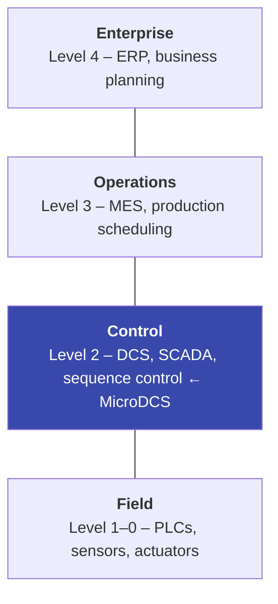
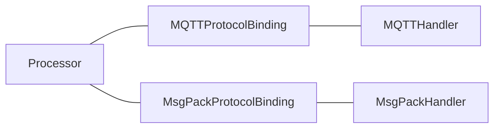

# Concepts at a Glance

This page introduces the core concepts you need to understand before working with MicroDCS. Each section gives a brief explanation and points to deeper documentation where available.

## Domain Concepts

### OT and the ISA-95 Automation Pyramid

MicroDCS targets **Operational Technology (OT)** — the hardware and software that monitors and controls physical manufacturing processes. The ISA-95 standard defines a layered model (often drawn as a pyramid) for how systems at different levels interact:

**Northbound** communication goes up the pyramid (toward MES/ERP). **Southbound** goes down (toward PLCs/equipment). These directions define how MicroDCS processors subscribe and publish — see [Processor Binding Direction](#processor-binding-direction) below.

For background on ISA-95, see [Information Model Standards](information-model-standards.md).

### OPC UA and Companion Specifications

[OPC UA](https://opcfoundation.org/about/opc-technologies/opc-ua/) is an industrial interoperability standard. MicroDCS does **not** use OPC UA's own transport (client/server or PubSub). Instead, it uses OPC UA **information models** — the data structures and state machines defined in companion specifications — and carries them over MQTT v5 as CloudEvent payloads.

The main companion specification used is [OPC 40001-3: Machinery Job Management](https://reference.opcfoundation.org/Machinery/Jobs/v100/docs/), which defines how to model job orders, job responses, and the state machine controlling a job's lifecycle (store, start, pause, resume, stop, abort, cancel, clear).

### ISA-95 Job Management

ISA-95 defines data structures for manufacturing operations: **job orders** (what to produce), **job responses** (status and results), and **work masters** (templates/recipes). MicroDCS maps these to Python dataclasses generated from JSON Schema and persists them in Redis. The `MachineryJobsCloudEventProcessor` implements the full OPC UA job state machine on top of these structures.

## Framework Concepts

### CloudEvents

[CloudEvents](https://cloudevents.io/) is a CNCF specification for describing events in a common way. Every message in MicroDCS is wrapped in a CloudEvent envelope with standard attributes:

| Attribute | Purpose |
|---|---|
| `type` | Identifies the event kind (e.g. `com.example.ping.v1`) — used to route to the correct `@incoming` handler |
| `source` | Identifies the producer (set from `ProcessingConfig.cloudevent_source`) |
| `dataschema` | URI identifying the payload schema |
| `datacontenttype` | Payload encoding: `application/json` or `application/msgpack` |
| `subject` | Context qualifier (e.g. asset ID or scope) — extracted by `@scope_from_subject` / `@asset_id_from_subject` |
| `correlationid` | Groups related events in the same workflow |
| `causationid` | Points to the event that caused this one (causal chain) |
| `expiryinterval` | Seconds until the event is no longer useful (maps to MQTT Message Expiry Interval) |

MicroDCS extends the base spec with error attributes (`mdcserrorkind`, `mdcserrormessage`) and `custommetadata` for hidden-field round-tripping.

### Processor

A **processor** (`CloudEventProcessor` subclass) is the central abstraction for application logic. It handles one domain (e.g. greetings, job management) and is protocol-agnostic. A processor:

- Receives incoming CloudEvents via `@incoming`-decorated methods
- Produces outgoing CloudEvents via `@outgoing`-decorated methods or by returning dataclasses from `@incoming` handlers
- Implements three abstract methods for response handling, expiration, and application-triggered events

See [Your First Processor](your-first-processor.md) for a complete walkthrough.

### Processor Binding Direction

Every processor is decorated with `@processor_config(binding=...)` which sets its **binding direction**:

| Binding | Subscribes to | Publishes to | Typical role |
|---|---|---|---|
| `NORTHBOUND` | commands | data, events, metadata | Executes work — receives instructions from above, reports results back up |
| `SOUTHBOUND` | data, events, metadata | commands | Orchestrates — receives status from below, sends commands down |

Think of it this way:

- A **northbound** processor is like a worker on the factory floor: it listens for commands ("start job", "store order") and publishes data, events, and metadata in response.
- A **southbound** processor is like a supervisor: it listens for data/events ("job completed", "temperature reading") and issues commands in response.

You can override the defaults with explicit `subscribe_intents` and `publish_intents` sets when the standard patterns don't fit.

### Three Abstract Methods

Every processor must implement these methods. They handle the paths that `@incoming`/`@outgoing` decorators don't cover:

| Method | When it's called | Typical use |
|---|---|---|
| `process_response_cloudevent(cloudevent)` | A transport-level response arrives (e.g. on an MQTT response topic) | Update state based on acknowledgements, trigger follow-up events |
| `handle_cloudevent_expiration(cloudevent, timeout)` | A published event's expiry interval elapses without a response | Retry, raise alarms, clean up state |
| `trigger_outgoing_event(**kwargs)` | Your application code needs to emit an event proactively (timer, API call, state change) | Create and publish events outside the request-response flow |

All three return `list[CloudEvent] | CloudEvent | None`. Return `None` when no follow-up is needed.

### Protocol Handler and Protocol Binding

A **protocol handler** (`ProtocolHandler`) manages the transport connection — MQTT or MessagePack-RPC. It runs as an async task, handles connection lifecycle, retry/backoff, and message dispatch.

A **protocol binding** (`ProtocolBinding`) connects a processor to a handler. It defines topic patterns, manages the outgoing event queue, and registers the processor's publish handler with the transport. One processor can be registered with multiple bindings (e.g. both MQTT and MessagePack) to receive events from multiple transports simultaneously.

### Message Intent

Messages are categorized by **intent**, which maps to the MQTT topic structure:

| Intent | Topic segment | Description |
|---|---|---|
| `DATA` | `data` | Telemetry, measured values, state variables |
| `EVENT` | `events` | Occurrences worth recording (alarms, state changes) |
| `COMMAND` | `commands` | Instructions to execute (start, stop, store) |
| `META` | `metadata` | Capability descriptions, retained configuration |

The processor's binding direction determines which intents it subscribes to and publishes on.

### Response Chain

The **response chain** is how a request dataclass creates a properly typed response object. It has three mechanisms:

1. **`DataClassResponseMixin[R]`** — Added to request classes by the code generator when `x-response-type` is set in the JSON Schema. Provides a `.response(**kwargs)` method that creates an instance of type `R`.

2. **`takeover`** — Optional list of field names passed to `.response(takeover=[...])`. Listed fields are copied from the request to the response. Common in OPC UA patterns where request and response share an ID field.

3. **`__request_object__` injection** — If the response class declares an `__request_object__` `InitVar`, `.response()` automatically injects the request instance. The mixin `__post_init__` then copies hidden fields from request to response, enabling round-tripping of metadata that doesn't appear in the serialized payload.

See [The Response Chain](your-first-processor.md#the-response-chain) for a detailed walkthrough with code examples.

### Hidden Fields and Custom Metadata

Fields prefixed with `_` are **hidden fields** — they are stripped from the serialized payload by `DataClassMixin.__post_serialize__`. To transport them across the wire, the framework uses CloudEvent `custommetadata`:

- **Outgoing**: `__get_custom_metadata__()` extracts hidden fields into a dict, which is placed into the CloudEvent's `custommetadata`
- **Incoming**: `custommetadata` values are passed to the dataclass via `__custom_metadata__` or `_consume_custom_metadata()`, and the mixin `__post_init__` writes them back into the hidden fields

This lets you carry out-of-band data (routing hints, tracing context, internal state) without polluting the application payload.

### DataClassMixin and Code Generation

All model dataclasses inherit from `DataClassMixin`, which provides:

- **JSON serialization** via mashumaro + orjson (`to_jsonb()`, `to_json()`, `from_json()`)
- **MessagePack serialization** via mashumaro + msgpack (`to_msgpack()`, `from_msgpack()`)
- **Hidden field stripping** in `__post_serialize__`
- **Serialization context** for Redis persistence metadata (`_dataschema`, `_scope`, `_normalized_state`)

Dataclasses are generated from JSON Schema using `microdcs dataclassgen dataclasses`. Each generated class has an inner `Config(DataClassConfig)` with `cloudevent_type` and `cloudevent_dataschema` attributes that the framework uses for routing and envelope construction.

## Glossary

| Term | Definition |
|---|---|
| **Binding direction** | Whether a processor faces northbound (executes work) or southbound (orchestrates). Determines subscribe/publish intents. |
| **CloudEvent** | A CNCF standard envelope for event data. All MicroDCS messages use this format. |
| **CloudEventProcessor** | Base class for application logic. Handles a single domain's incoming and outgoing events. |
| **Config (inner class)** | `DataClassConfig` subclass inside every model dataclass. Holds `cloudevent_type` and `cloudevent_dataschema`. |
| **Custom metadata** | Key-value pairs carried in the CloudEvent envelope alongside the payload. Used for hidden field transport. |
| **DataClassMixin** | Base mixin providing JSON and MessagePack serialization for all model dataclasses. |
| **DataClassResponseMixin** | Generic mixin that adds `.response()` to request dataclasses, enabling typed response creation. |
| **Hidden fields** | Dataclass fields prefixed with `_`. Excluded from serialization, transported via custom metadata. |
| **ISA-95** | International standard for manufacturing operations integration. Defines job orders, responses, and the automation pyramid. |
| **Message intent** | Category of a message: `DATA`, `EVENT`, `COMMAND`, or `META`. Maps to MQTT topic segments. |
| **MicroDCS** | The application class that wires handlers, bindings, and processors together and runs the main event loop. |
| **Mixin** | Hand-written `*_mixin.py` class that provides `__post_init__` logic for hidden fields and metadata handling. |
| **Northbound** | Processor direction facing up the ISA-95 pyramid. Subscribes to commands, publishes data/events/metadata. |
| **OPC UA** | Industrial interoperability standard. MicroDCS uses its information models (not its transport). |
| **Processor binding** | Connects a processor to a protocol handler. Manages topic patterns and outgoing queue. |
| **Protocol handler** | Manages transport connections (MQTT or MessagePack-RPC). Runs as an async task. |
| **Response chain** | The mechanism by which request dataclasses create typed response objects via `.response()`. |
| **Southbound** | Processor direction facing down the ISA-95 pyramid. Subscribes to data/events/metadata, publishes commands. |
| **Takeover** | List of field names copied from request to response in `.response(takeover=[...])`. |
| **`__request_object__`** | `InitVar` field in response dataclasses. Automatically populated by `.response()` with the request instance. |
