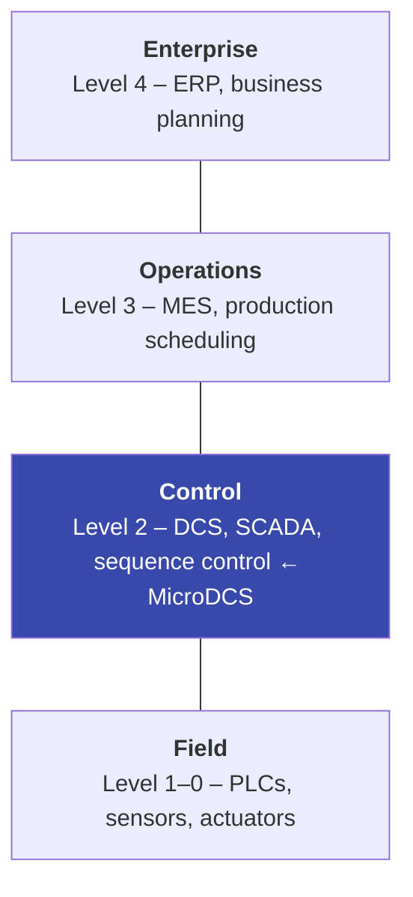
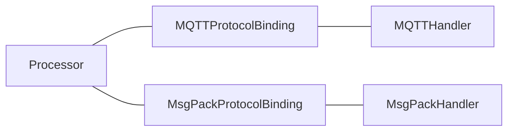
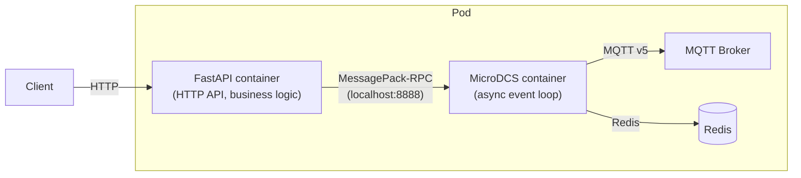

# Concepts at a Glance

This page introduces the core concepts you need to understand before working with MicroDCS. Each section gives a brief explanation and points to deeper documentation where available.

## Domain Concepts

### OT and the ISA-95 Automation Pyramid

MicroDCS targets **Operational Technology (OT)** — the hardware and software that monitors and controls physical manufacturing processes. The ISA-95 standard defines a layered model (often drawn as a pyramid) for how systems at different levels interact:



**Northbound** communication goes up the pyramid (toward MES/ERP). **Southbound** goes down (toward PLCs/equipment). These directions define how MicroDCS processors subscribe and publish — see [Processor Binding Direction](#processor-binding-direction) below.

For background on ISA-95, see [Information Model Standards](information-model-standards.md).

### OPC UA and Companion Specifications

[OPC UA](https://opcfoundation.org/about/opc-technologies/opc-ua/) is an industrial interoperability standard. MicroDCS does **not** use OPC UA's own transport (client/server or PubSub). Instead, it uses OPC UA **information models** — the data structures and state machines defined in companion specifications — and carries them over MQTT v5 as CloudEvent payloads.

The main companion specification used is [OPC 40001-3: Machinery Job Management](https://reference.opcfoundation.org/Machinery/Jobs/v100/docs/), which defines how to model job orders, job responses, and the state machine controlling a job's lifecycle (store, start, pause, resume, stop, abort, cancel, clear).

### ISA-95 Job Management

ISA-95 defines data structures for manufacturing operations: **job orders** (what to produce), **job responses** (status and results), and **work masters** (templates/recipes). MicroDCS maps these to Python dataclasses generated from JSON Schema and persists them in Redis. The `MachineryJobsCloudEventProcessor` implements the full OPC UA job state machine on top of these structures.

#### Extended Work Master

A standard Work Master (`ISA95WorkMasterDataType`) carries only an ID, description, and parameters — the OPC UA envelope. The **extended Work Master** (`ISA95WorkMasterDataTypeExt`) adds two optional fields following the CloudEvent envelope pattern:

| Field | Type | Purpose |
|---|---|---|
| `data` | `dict[str, Any] \| list[Any] \| None` | Recipe content as JSON — structure defined by `dataschema` |
| `dataschema` | `str \| None` | URI identifying the schema that `data` adheres to |

Both fields default to `None`, so Work Masters without recipe content remain valid. The `dataschema` URI discriminates the semantic type — an SFC recipe schema is one possible value, but the design is open to other recipe formats without changes to the Work Master envelope, the NB processor, or the DAO layer. The `WorkMasterDAO` stores and retrieves `ISA95WorkMasterDataTypeExt` instances, serializing the extended fields to Redis JSON when present.

#### Station Configuration Delivery

The `MachineryJobsCloudEventProcessor` validates incoming Job Orders against configurable checks (equipment IDs, material classes, personnel, physical assets, Work Master IDs, and max downloadable orders). The corresponding DAOs exist, but these lists must be populated before any Job Order can pass validation.

**Station configuration** is pushed from the MES/MOM layer into MicroDCS via CloudEvents on the NB processor, using the same pattern as Job Orders. Each configuration type has a dedicated CloudEvent type (e.g. `com.github.aschamberger.ISA95-JOBCONTROL_V2.config.equipment.v1`) and is scoped via the CloudEvent `subject`.

Operations use the `method` CloudEvent extension attribute following HTTP-style semantics:

- **`PUT`** (default when `method` is absent) — upsert: add the resource to the list, store the Work Master, or set the config value
- **`DELETE`** — remove the resource from the list, delete the Work Master, or remove the config value

The `max_downloadable_job_orders` setting is persisted per scope via `JobAcceptanceConfigDAO` in Redis, so it survives pod restarts. The `is_job_acceptable()` method queries the DAO for a scope-specific override and falls back to the code-configured default in `JobAcceptanceConfig`.

## Framework Concepts

### CloudEvents

[CloudEvents](https://cloudevents.io/) is a CNCF specification for describing events in a common way. Every message in MicroDCS is wrapped in a CloudEvent envelope with standard attributes:

| Attribute | Purpose |
|---|---|
| `type` | Identifies the event kind (e.g. `com.example.ping.v1`) — used to route to the correct `@incoming` handler |
| `source` | Identifies the producer (set from `ProcessingConfig.cloudevent_source`) |
| `dataschema` | URI identifying the payload schema |
| `datacontenttype` | Payload encoding: `application/json` or `application/msgpack` |
| `subject` | Context qualifier (e.g. asset ID or scope) — extracted by `@scope_from_subject` / `@asset_id_from_subject` |
| `correlationid` | Groups related events in the same workflow |
| `causationid` | Points to the event that caused this one (causal chain) |
| `expiryinterval` | Seconds until the event is no longer useful (maps to MQTT Message Expiry Interval) |

MicroDCS extends the base spec with error attributes (`mdcserrorkind`, `mdcserrormessage`), a `method` attribute for station configuration delivery (`PUT` / `DELETE`), and `custommetadata` for hidden-field round-tripping.

### Processor

A **processor** (`CloudEventProcessor` subclass) is the central abstraction for application logic. It handles one domain (e.g. greetings, job management) and is protocol-agnostic. A processor:

- Receives incoming CloudEvents via `@incoming`-decorated methods
- Produces outgoing CloudEvents via `@outgoing`-decorated methods or by returning dataclasses from `@incoming` handlers
- Implements three abstract methods for response handling, expiration, and application-triggered events

See [Your First Processor](your-first-processor.md) for a complete walkthrough.

### Processor Binding Direction

Every processor is decorated with `@processor_config(binding=...)` which sets its **binding direction**:

| Binding | Subscribes to | Publishes to | Typical role |
|---|---|---|---|
| `NORTHBOUND` | commands | data, events, metadata | Executes work — receives instructions from above, reports results back up |
| `SOUTHBOUND` | data, events, metadata | commands | Orchestrates — receives status from below, sends commands down |

Think of it this way:

- A **northbound** processor is like a worker on the factory floor: it listens for commands ("start job", "store order") and publishes data, events, and metadata in response.
- A **southbound** processor is like a supervisor: it listens for data/events ("job completed", "temperature reading") and issues commands in response.

You can override the defaults with explicit `subscribe_intents` and `publish_intents` sets when the standard patterns don't fit.

### Three Abstract Methods

Every processor must implement these methods. They handle the paths that `@incoming`/`@outgoing` decorators don't cover:

| Method | When it's called | Typical use |
|---|---|---|
| `process_response_cloudevent(cloudevent)` | A transport-level response arrives (e.g. on an MQTT response topic) | Update state based on acknowledgements, trigger follow-up events |
| `handle_cloudevent_expiration(cloudevent, timeout)` | A published event's expiry interval elapses without a response | Retry, raise alarms, clean up state |
| `trigger_outgoing_event(**kwargs)` | Your application code needs to emit an event proactively (timer, API call, state change) | Create and publish events outside the request-response flow |

All three return `list[CloudEvent] | CloudEvent | None`. Return `None` when no follow-up is needed.

### Protocol Handler and Protocol Binding

A **protocol handler** (`ProtocolHandler`) manages the transport connection — MQTT or MessagePack-RPC. It runs as an async task, handles connection lifecycle, retry/backoff, and message dispatch.

A **protocol binding** (`ProtocolBinding`) connects a processor to a handler. It defines topic patterns, manages the outgoing event queue, and registers the processor's publish handler with the transport. One processor can be registered with multiple bindings (e.g. both MQTT and MessagePack) to receive events from multiple transports simultaneously.



### MessagePack-RPC Transport

MicroDCS includes a **MessagePack-RPC** transport alongside MQTT. It is a TCP-based, binary RPC server built on the [MessagePack-RPC specification](https://github.com/msgpack-rpc/msgpack-rpc/blob/master/spec.md) and supports three frame types:

| Frame type | Direction | Purpose |
|---|---|---|
| REQUEST | Client → Server | Call an RPC method and wait for a response |
| RESPONSE | Server → Client | Return result or error for a request |
| NOTIFICATION | Both | Fire-and-forget message (no response expected) |

The server exposes two built-in RPC methods:

- **`publish(cloudevent_dict, transportmetadata)`** — Submits a CloudEvent for processing. The server deserializes it, routes it through all registered processors, and returns the response CloudEvents as a list of dicts.
- **`heartbeat(timestamp)`** — A notification-only keepalive. No return value.

Outgoing CloudEvents (produced by processors) are sent to all connected clients as **NOTIFICATION** frames with method name `cloudevent` and params `[cloudevent_dict, intent_value]`.

#### Why MessagePack-RPC? The Sidecar Pattern

The MessagePack-RPC transport is designed for **sidecar container deployments** where different concerns run in separate containers within the same pod:



This separation keeps the MicroDCS async event loop fast and unblocked for time-critical control sequences, while the API container handles HTTP requests, authentication, and synchronous business logic. The API container acts as an RPC client that calls `publish` to inject CloudEvents into the processing pipeline, and receives outgoing events via notification frames.

Typical use cases:

- A **FastAPI** sidecar exposes a REST API for operators or external systems, translating HTTP requests into CloudEvents sent via MessagePack-RPC
- A **device connector** sidecar translates proprietary device protocols into CloudEvents
- A **data pipeline** sidecar collects and batches telemetry before forwarding to the DCS

#### Client Usage

MicroDCS ships a `MessagePackRpcClient` for use in sidecar containers:

```python
from microdcs.msgpack import MessagePackRpcClient

async with MessagePackRpcClient(host="localhost", port=8888) as client:
    # Send a CloudEvent for processing (REQUEST → RESPONSE)
    cloudevent_dict = {
        "type": "com.example.ping.v1",
        "source": "urn:api:sidecar",
        "datacontenttype": "application/json; charset=utf-8",
        "data": b'{"message": "hello"}',
    }
    responses = await client.call("publish", cloudevent_dict)
    # responses is a list of CloudEvent dicts

    # Send a heartbeat (NOTIFICATION, no response)
    await client.notify("heartbeat", 1234567890)
```

#### Configuration

The MessagePack-RPC server is configured via environment variables with prefix `APP_MSGPACK_`:

| Variable | Default | Purpose |
|---|---|---|
| `APP_MSGPACK_HOSTNAME` | `localhost` | Listen address |
| `APP_MSGPACK_PORT` | `8888` | Listen port |
| `APP_MSGPACK_TLS_CERT_PATH` | `/var/run/certs/ca.crt` | TLS certificate (enabled when file exists) |
| `APP_MSGPACK_MAX_QUEUED_CONNECTIONS` | `100` | TCP backlog |
| `APP_MSGPACK_MAX_CONCURRENT_REQUESTS` | `10` | Per-client concurrency limit (backpressure) |
| `APP_MSGPACK_MAX_BUFFER_SIZE` | `8388608` (8 MiB) | Max unpacker buffer to bound memory usage |
| `APP_MSGPACK_BINDING_OUTGOING_QUEUE_SIZE` | `5` | Outgoing notification queue depth |

### Message Intent

Messages are categorized by **intent**, which maps to the MQTT topic structure:

| Intent | Topic segment | Description |
|---|---|---|
| `DATA` | `data` | Telemetry, measured values, state variables |
| `EVENT` | `events` | Occurrences worth recording (alarms, state changes) |
| `COMMAND` | `commands` | Instructions to execute (start, stop, store) |
| `META` | `metadata` | Capability descriptions, retained configuration |

The processor's binding direction determines which intents it subscribes to and publishes on.

### Publisher

A **publisher** (`MQTTPublisher` subclass) is a long-running task that maintains retained MQTT topics based on Redis state changes. Unlike protocol handlers, publishers do not process incoming CloudEvents — they are write-only components that read from Redis streams and publish retained messages.

`MQTTPublisher` manages an MQTT client connection with automatic reconnect/backoff, and exposes `publish_retained(topic, payload, ttl)` and `delete_retained(topic)`. Application-specific publishers subclass `MQTTPublisher` and override the `_run()` hook to implement their stream-reading loop.

The `JobOrderPublisher` is the built-in publisher that maintains per-job retained topics (`order/{id}`, `result/{id}`) and a per-scope `state-index` topic. It consumes the [Job Change Stream](#glossary) written by the DAO layer and dispatches retained publishes based on the change type. See [Machinery Jobs – MES Northbound Publishing](machinery-jobs-mes-publishing.md) for the full design.

Publishers are registered via `MicroDCS.add_additional_task()` and controlled by the `APP_IS_PUBLISHER_INSTANCE` flag, enabling separate deployment of processor and publisher roles.

### Response Chain

The **response chain** is how a request dataclass creates a properly typed response object. It has three mechanisms:

1. **`DataClassResponseMixin[R]`** — Added to request classes by the code generator when `x-response-type` is set in the JSON Schema. Provides a `.response(**kwargs)` method that creates an instance of type `R`.

2. **`takeover`** — Optional list of field names passed to `.response(takeover=[...])`. Listed fields are copied from the request to the response. Common in OPC UA patterns where request and response share an ID field.

3. **`__request_object__` injection** — If the response class declares an `__request_object__` `InitVar`, `.response()` automatically injects the request instance. The mixin `__post_init__` then copies hidden fields from request to response, enabling round-tripping of metadata that doesn't appear in the serialized payload.

See [The Response Chain](your-first-processor.md#the-response-chain) for a detailed walkthrough with code examples.

### Hidden Fields and Custom Metadata

Fields prefixed with `_` are **hidden fields** — they are stripped from the serialized payload by `DataClassMixin.__post_serialize__`. To transport them across the wire, the framework uses CloudEvent `custommetadata`:

- **Outgoing**: `__get_custom_metadata__()` extracts hidden fields into a dict, which is placed into the CloudEvent's `custommetadata`
- **Incoming**: `custommetadata` values are passed to the dataclass via `__custom_metadata__` or `_consume_custom_metadata()`, and the mixin `__post_init__` writes them back into the hidden fields

This lets you carry out-of-band data (routing hints, tracing context, internal state) without polluting the application payload.

### DataClassMixin and Code Generation

All model dataclasses inherit from `DataClassMixin`, which provides:

- **JSON serialization** via mashumaro + orjson (`to_jsonb()`, `to_json()`, `from_json()`)
- **MessagePack serialization** via mashumaro + msgpack (`to_msgpack()`, `from_msgpack()`)
- **Hidden field stripping** in `__post_serialize__`
- **Serialization context** for Redis persistence metadata (`_dataschema`, `_scope`, `_normalized_state`)

Dataclasses are generated from JSON Schema using `microdcs dataclassgen dataclasses`. Each generated class has an inner `Config(DataClassConfig)` with `cloudevent_type` and `cloudevent_dataschema` attributes that the framework uses for routing and envelope construction.

## Glossary

| Term | Definition |
|---|---|
| **Action association** | SFC action bound to a step with a qualifier and interaction pattern (`push_command` or `pull_event`). See `SfcActionAssociation`. |
| **Action qualifier** | IEC 61131-3 qualifier (`N`, `P`, `P0`, `P1`, `S`, `R`, `L`, `D`) controlling when and how an action executes relative to its step. See `SfcActionQualifier`. |
| **Binding direction** | Whether a processor faces northbound (executes work) or southbound (orchestrates). Determines subscribe/publish intents. |
| **CloudEvent** | A CNCF standard envelope for event data. All MicroDCS messages use this format. |
| **CloudEventProcessor** | Base class for application logic. Handles a single domain's incoming and outgoing events. |
| **Config (inner class)** | `DataClassConfig` subclass inside every model dataclass. Holds `cloudevent_type` and `cloudevent_dataschema`. |
| **Custom metadata** | Key-value pairs carried in the CloudEvent envelope alongside the payload. Used for hidden field transport. |
| **DataClassMixin** | Base mixin providing JSON and MessagePack serialization for all model dataclasses. |
| **DataClassResponseMixin** | Generic mixin that adds `.response()` to request dataclasses, enabling typed response creation. |
| **`dataschema` (Work Master)** | URI field on `ISA95WorkMasterDataTypeExt` identifying the schema that the Work Master's `data` payload adheres to. |
| **Extended Work Master** | `ISA95WorkMasterDataTypeExt` — extends the OPC UA Work Master with opaque `data` and `dataschema` fields for carrying recipe content. |
| **Hidden fields** | Dataclass fields prefixed with `_`. Excluded from serialization, transported via custom metadata. |
| **ISA-95** | International standard for manufacturing operations integration. Defines job orders, responses, and the automation pyramid. |
| **Job Change Stream** | A Redis stream (`joborder:changes:{scope}`) written atomically by `JobOrderAndStateDAO.save()` and `JobResponseDAO.save()` on every state change. Consumed by the Job Order Publisher to drive retained MQTT topic updates. A global sentinel stream (`joborder:changes:_global`) mirrors every entry for new-scope discovery. |
| **Message intent** | Category of a message: `DATA`, `EVENT`, `COMMAND`, or `META`. Maps to MQTT topic segments. |
| **MessagePack-RPC** | Binary TCP-based RPC transport. Used in sidecar deployments to decouple HTTP/API containers from the MicroDCS event loop. |
| **`method` (CloudEvent)** | HTTP-style extension attribute on CloudEvent (`PUT` / `DELETE`). Used by station configuration delivery handlers to distinguish upsert from delete. Mapped to `ce_method` in handler kwargs. |
| **MicroDCS** | The application class that wires handlers, bindings, and processors together and runs the main event loop. |
| **Mixin** | Hand-written `*_mixin.py` class that provides `__post_init__` logic for hidden fields and metadata handling. |
| **Northbound** | Processor direction facing up the ISA-95 pyramid. Subscribes to commands, publishes data/events/metadata. |
| **OPC UA** | Industrial interoperability standard. MicroDCS uses its information models (not its transport). |
| **Processor binding** | Connects a processor to a protocol handler. Manages topic patterns and outgoing queue. |
| **Protocol handler** | Manages transport connections (MQTT or MessagePack-RPC). Runs as an async task. |
| **`pull_event`** | SFC interaction pattern where the engine waits for equipment to deliver an incoming CloudEvent. |
| **Publisher** | An `MQTTPublisher` subclass that reads Redis streams and maintains retained MQTT topics. Write-only — does not process incoming CloudEvents. Registered as an additional task and controlled by `APP_IS_PUBLISHER_INSTANCE`. |
| **Response chain** | The mechanism by which request dataclasses create typed response objects via `.response()`. |
| **Selection branch** | SFC OR-divergence: one path taken based on transition priorities/conditions. See `SfcBranch` with `SfcBranchType.selection`. |
| **SFC recipe** | `SfcRecipe` dataclass — IEC 61131-3 SFC recipe containing steps, transitions, action associations, and optional branches. Stored as JSON in the Work Master's `data` field with `dataschema` set to `SFC_RECIPE_DATASCHEMA`. |
| **Simultaneous branch** | SFC AND-divergence: all paths execute in parallel and must complete before convergence. See `SfcBranch` with `SfcBranchType.simultaneous`. |
| **Retained Topic** | An MQTT v5 topic published with the retained flag set. The broker stores the last message and delivers it immediately to new subscribers. MicroDCS uses retained topics (with a 48-hour Message Expiry Interval) to expose current job order and result state to the MES so that reconnecting clients receive the full picture without replaying events. |
| **Sidecar pattern** | Kubernetes pod design where a secondary container (e.g. FastAPI) communicates with the MicroDCS container via MessagePack-RPC. |
| **Southbound** | Processor direction facing down the ISA-95 pyramid. Subscribes to data/events/metadata, publishes commands. |
| **Station configuration** | Resource lists (equipment, material, personnel, physical assets), Work Masters, and operational parameters (max downloadable job orders) pushed from MES into MicroDCS via CloudEvents. Scoped per station via CloudEvent `subject`. |
| **Step** | SFC named state. Maps to a `transitions` library state. Each step can have associated actions. See `SfcStep`. |
| **State Index** | A retained MQTT topic (`{prefix}/{scope}/state-index`) published by the Job Order Publisher on every job state transition. Contains the sequence number, scope, timestamp, and a compact list of all active jobs with their current state and `has_result` flag. Used by the MES to detect gaps after a connectivity outage and to know which per-job retained topics to fetch. |
| **Takeover** | List of field names copied from request to response in `.response(takeover=[...])`. |
| **Transition** | SFC directed edge between steps/branches. Carries a condition identifier resolved at runtime. See `SfcTransition`. |
| **Work Master** | ISA-95 template/recipe referenced by Job Orders. Stored in Redis via `WorkMasterDAO`. The base type is `ISA95WorkMasterDataType`; the extended type `ISA95WorkMasterDataTypeExt` adds opaque recipe content. |
| **`push_command`** | SFC interaction pattern where the engine sends an outgoing CloudEvent command to equipment. |
| **`__request_object__`** | `InitVar` field in response dataclasses. Automatically populated by `.response()` with the request instance. |
