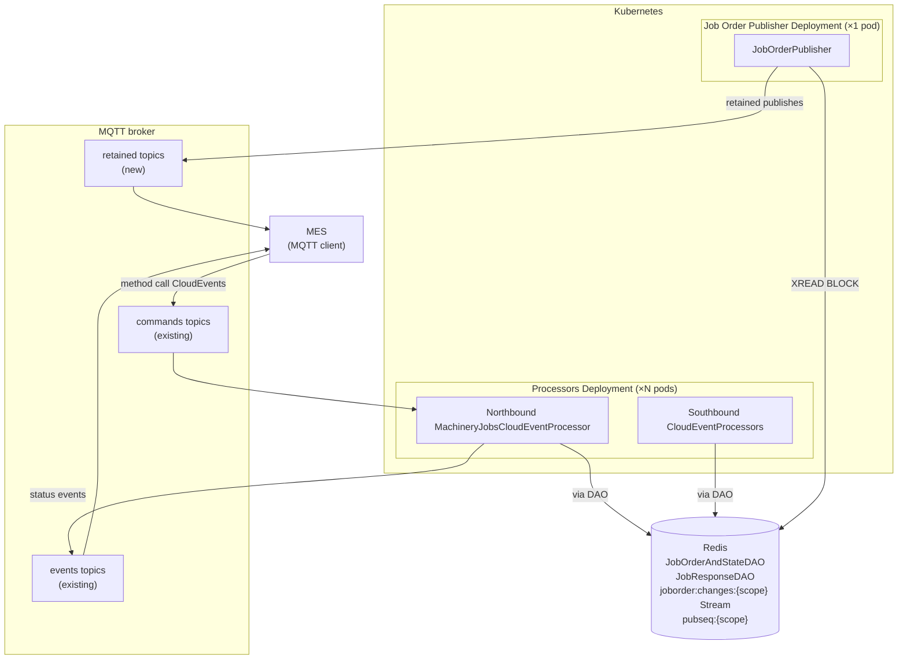
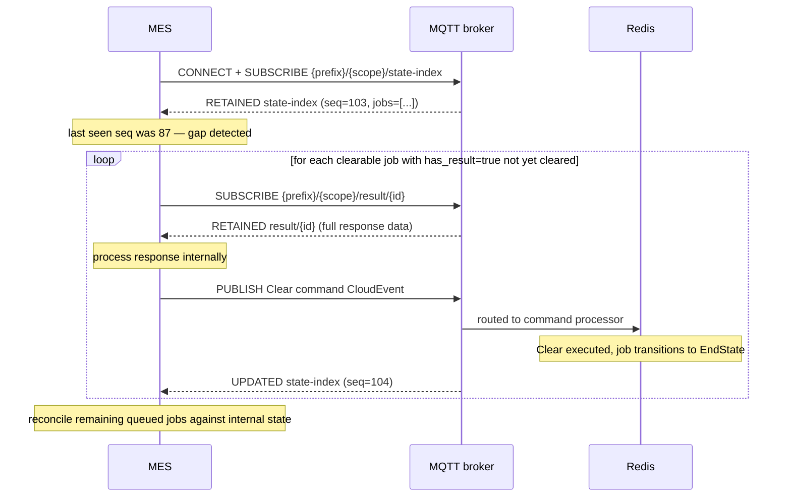

# Machinery Jobs – MES Northbound Publishing

This page describes the design of the northbound MQTT publishing interface that makes job order state and job response data reliably available to a Manufacturing Execution System (MES) across connectivity outages. It extends the existing `MachineryJobsCloudEventProcessor` without modifying its command handling logic and adds a dedicated publisher component that maintains retained MQTT topics per job.

## Background

The [OPC 40001-3: Machinery Job Management](https://reference.opcfoundation.org/Machinery/Jobs/v100/docs/) specification defines two integration approaches for exposing job state to clients:

- **Event-based** – Clients subscribe to `ISA95JobOrderStatusEventType` events fired on each state transition. The existing `MachineryJobsCloudEventProcessor` fully implements this mode. Events are low-latency and efficient but provide no recovery path for clients that miss messages during a connectivity outage.
- **List/variable-based** – The `ISA95JobOrderReceiverObjectType` exposes a `JobOrderList` variable and the `ISA95JobResponseProviderObjectType` exposes a `JobOrderResponseList` variable. These always reflect current state and can be published as retained MQTT messages so that reconnecting clients receive the full picture immediately.

The existing implementation covers the event-based mode. The list/variable-based mode is absent.

### Why the event-based mode alone is insufficient

Job lifecycle in MicroDCS involves two distinct actors:

- The **MES** creates and controls job order definitions (Store, StoreAndStart, Start, Abort, etc.)
- The **DCS** drives physical state transitions and produces all job response data (process actuals, serial numbers, torque values, temperatures, machine IDs)

The MES is therefore the originator of job definitions but a *consumer* of state changes and job response data that it cannot reconstruct from its own records. If the MES misses a DCS-originated status event or a job response update during a connectivity outage, it has no way to detect the gap from the event stream alone.

The system must tolerate MES connectivity outages of up to 30 minutes. In high-cadence scenarios (in-house parts production, job iterations in the order of seconds), dozens of jobs can complete and accumulate response data during such an outage. The existing `Clear` method — already implemented — acts as the MES acknowledgment: the MES calls `Clear` after successfully processing a job response, which transitions the job to `EndState`. Jobs in clearable states (`Ended`, `Aborted`) therefore remain available in Redis until the MES explicitly clears them, but nothing currently exposes this durably over MQTT.

### Why a single full-list retained publish does not fit

Publishing the complete `JobOrderList` or `JobOrderResponseList` on every state transition is traffic-inefficient for this application:

- Job order objects carry all input parameters: equipment, material, personnel, physical asset, and work master references. These are large and do not change after a job is stored.
- Job response objects accumulate all process data over the job's lifetime. In a traceability-oriented production context (serial numbers, set-point vs. actual torques, temperatures) a single response entry can reach several kilobytes.

Publishing complete lists on every transition would retransmit unchanged large payloads repeatedly. The split design below avoids this.

## Design

### Component overview

The extension adds one new component — the **Job Order Publisher** — alongside the existing command processors. The publisher can run as a separate Kubernetes Deployment or co-located in the same container, controlled by `RuntimeConfig.is_processor_instance` and `RuntimeConfig.is_publisher_instance` (env vars `APP_IS_PROCESSOR_INSTANCE`, `APP_IS_PUBLISHER_INSTANCE`, both default `True`). The stream write that feeds the publisher is encapsulated in the existing DAOs, so no processor — northbound or southbound — needs to be aware of the publishing infrastructure.

The `MQTTPublisher` class in `src/microdcs/mqtt.py` is registered via `MicroDCS.add_additional_task()` and runs alongside protocol handlers in the main task group. It shares the `create_mqtt_client()` connection factory with `MQTTHandler` for consistent TLS/SAT-token authentication and reconnect behaviour.



### Why a separate container is recommended

The command processor scales horizontally and is latency-sensitive — it handles real-time commands from the MES and the DCS. The publisher is a singleton, throughput-oriented, and not latency-sensitive (MQTT retained delivery is inherently best-effort). Keeping them separate gives independent restart policies, resource limits, logging, and alerting. A bug or resource leak in the publisher does not affect command processing.

For development and simple deployments, both roles can co-exist in a single container by leaving both `APP_IS_PROCESSOR_INSTANCE` and `APP_IS_PUBLISHER_INSTANCE` at their default value of `true`. For production, set one flag per deployment to separate concerns.

### High availability

Leader election for the publisher is not needed. Pod restart time is 10–30 seconds. The system is already designed to tolerate 30-minute MES outages through the retained topic and sequence number scheme described below. A pod restart is two orders of magnitude smaller than the gap the recovery mechanism already handles. The retained topics are the availability story for the publisher. `replicas: 1` with no locking is the correct configuration.

### Topic design

All topics are scoped per machine using the same scope identifier used as the CloudEvent `subject` in the existing processor. All retained topics carry an MQTT v5 Message Expiry Interval configured via `retained_ttl_seconds` (default: 48 hours). This removes stale topics automatically if a scope goes inactive — for example after a machine is decommissioned or a scope is renamed — without requiring explicit cleanup logic in the publisher.

| Topic | Retained | Payload | Published when |
|---|---|---|---|
| `{prefix}/{scope}/state-index` | Yes | State index (see below) | Every state transition |
| `{prefix}/{scope}/order/{job_order_id}` | Yes | Full `ISA95JobOrderDataType` | On Store / StoreAndStart / Update; deleted on Clear |
| `{prefix}/{scope}/result/{job_order_id}` | Yes | Full `ISA95JobResponseDataType` | On job reaching a clearable state (`Ended` / `Aborted`); deleted on Clear |
| `{prefix}/{scope}/events` | No | `ISA95JobOrderStatusEventType` CloudEvent | Every state transition (existing, unchanged) |
| `{prefix}/{scope}/commands` | No | Method call CloudEvent | From MES (existing, unchanged) |
| `{prefix}/{scope}/metadata` | Yes | Metadata/capabilities CloudEvent | On publisher startup (existing, unchanged) |

The `{prefix}` is the existing configurable MQTT topic prefix for the machinery-jobs processor (e.g. `app/jobs`, configured via `APP_PROCESSING_TOPIC_PREFIXES`). The `{scope}` is the machine scope identifier used as the CloudEvent `subject`. The retained topics for the publisher (`state-index`, `order/{id}`, `result/{id}`) are new siblings alongside the existing `events`, `commands`, and `metadata` intent topics.

Deletion of retained topics on `Clear` is performed by publishing a zero-byte retained message to the same topic, which is the standard MQTT mechanism for clearing retained state.

The `order/{job_order_id}` and `result/{job_order_id}` topics carry large payloads but are written rarely — once on creation, once on update, once on reaching a clearable state, and deleted on `Clear`. The `state-index` topic changes on every transition but carries a small payload (state identifiers only, not full objects).

Job response data is published only when a job transitions to a clearable state (`Ended` or `Aborted`), not incrementally during execution. The publisher checks the current job state before publishing a `result/{job_order_id}` topic — `ResultUpdate` stream entries for jobs still in progress are ignored to prevent premature publication of partial results. The `result/{job_order_id}` topic therefore reflects the completed response and is not updated further before `Clear`.

> **Note**: `Interrupted` (substates `Held`, `Suspended`) is **not** a clearable state — it is a resumable pause state. Jobs in `Interrupted` can resume execution via `Resume`. Only `Ended` and `Aborted` allow the `Clear` transition to `EndState`.

### State index payload

The state index is the high-frequency retained topic. It contains only the fields that change on transitions and the minimum needed for the MES to understand which per-job topics to fetch.

```json
{
  "seq": 103,
  "scope": "machine-42",
  "published_at": "2026-04-11T14:23:01Z",
  "jobs": [
    {
      "job_order_id": "JO-2026-0441",
      "state": [
        {"state_text": {"text": "Running", "locale": "en"}, "state_number": 3}
      ],
      "has_result": false
    },
    {
      "job_order_id": "JO-2026-0442",
      "state": [
        {"state_text": {"text": "Ended", "locale": "en"}, "state_number": 5}
      ],
      "has_result": true
    },
    {
      "job_order_id": "JO-2026-0443",
      "state": [
        {"state_text": {"text": "NotAllowedToStart", "locale": "en"}, "state_number": 1},
        {"state_text": {"text": "Ready", "locale": "en"}, "state_number": 11}
      ],
      "has_result": false
    }
  ]
}
```

The `seq` field is a monotonically increasing integer per scope, stored in Redis and incremented atomically on each state-index publish. It survives publisher restarts. The `has_result` flag tells the MES whether a `result/{job_order_id}` topic exists before subscribing to it.

### Reconnect and resync

On MES reconnect the sequence number provides gap detection without requiring stream replay or delta reconstruction:



If the sequence number matches the MES's last-seen value, no transitions were missed and no further action is needed. If it is ahead, the MES reads the retained `order/{id}` and `result/{id}` topics for jobs listed in the state index and reconciles against its internal records.

### Clear semantics

The `Clear` method (already implemented in `MachineryJobsCloudEventProcessor`) is the MES acknowledgment that a job response has been received and processed. The MES workflow:

1. Job reaches a clearable state (`Ended` or `Aborted`)
2. MES reads the retained `result/{job_order_id}` topic
3. MES records response data internally
4. MES calls `Clear` → command processor transitions job to `EndState` in Redis → publisher deletes the retained `order/{id}` and `result/{id}` topics → job is removed from the state-index

Note: `Clear` transitions the job state machine to `EndState` but does not delete the job from Redis. Jobs in `EndState` are excluded from the state-index (they have reached their final state). The publisher treats `Clear` stream entries as a signal to remove retained topics. Redis cleanup of `EndState` jobs is a separate TTL-based or scheduled concern — the publisher and the state-index do not list them.

During an outage, steps 1–4 are deferred. Jobs accumulate in clearable states with their response data preserved in retained topics until the MES reconnects and works through the backlog. The 48-hour TTL (default for `retained_ttl_seconds`) on retained topics acts as a safety net for the case where `Clear` is never called — for example if a job is abandoned after a machine fault.

## Changes to existing DAOs

The stream write is encapsulated in `JobOrderAndStateDAO` and `JobResponseDAO` so that no processor needs to be aware of the publishing infrastructure. Any call to `save()` on either DAO automatically appends a change record to the scope stream. This makes it structurally impossible for a new processor — northbound or southbound — to write job state without the publisher being notified.

`JobOrderAndStateDAO.save()` appends a record with the transition name as `change_type`:

The `xadd` is added to the same `pipeline(transaction=True)` block that already performs the JSON write and sorted-set update, so the stream entry is written atomically with the state change. If the pipeline fails, neither the state nor the stream entry is written.

```python
# Inside the existing pipeline(transaction=True) block:
pipe.xadd(
    self._key_schema.job_change_stream(scope),
    {
        "change_type": change_type,  # transition name, e.g. "Store", "Start", "Clear"
        "job_order_id": job_order_and_state.job_order.job_order_id,
        "scope": scope,
        "ts": datetime.now(UTC).isoformat(),
    },
    maxlen=5000,
    approximate=True,
)
```

`JobResponseDAO.save()` appends a record with `change_type` of `ResultUpdate`, also inside its existing pipeline:

```python
# Inside the existing pipeline(transaction=True) block:
pipe.xadd(
    self._key_schema.job_change_stream(scope),
    {
        "change_type": "ResultUpdate",
        "job_order_id": job_response.job_order_id,
        "scope": scope,
        "ts": datetime.now(UTC).isoformat(),
    },
    maxlen=5000,
    approximate=True,
)
```

The stream is bounded with `maxlen=5000` and `approximate=True`. At a job cadence of one job every few seconds, this covers well over 30 minutes of publisher downtime with negligible Redis memory overhead.

The following Redis key schema additions are required:

| Key | Type | Purpose |
|---|---|---|
| `joborder:changes:{scope}` | Stream | Change log consumed by the publisher |
| `pubseq:{scope}` | String (integer) | Monotonic sequence counter per scope |
| `publisher:stream-cursors` | Hash | Last-processed stream ID per scope, for publisher restart recovery |
| `active-scopes` | Set | All scopes that have had at least one job stored |
| `joborder:changes:_global` | Stream | Sentinel stream — every DAO save appends here for new-scope discovery |

The `active-scopes` set is updated with `SADD active-scopes {scope}` inside `JobOrderAndStateDAO.save()` on the first `Store` for a new scope.

In addition to `active-scopes`, a **sentinel stream** `joborder:changes:_global` receives an entry on every DAO save alongside the per-scope stream. The publisher's main XREAD loop always includes this global stream. When a message arrives on the global stream for a scope not yet tracked, the publisher adds the scope's per-scope stream to its XREAD set. This eliminates the need for periodic polling of `active-scopes` and ensures new scopes are discovered immediately.

## Job Order Publisher

The publisher is implemented as `JobOrderPublisher(MQTTPublisher)` in `src/microdcs/publishers/machinery_jobs.py`. It inherits MQTT connection lifecycle and reconnect/backoff from `MQTTPublisher` and overrides the `_run()` hook with its business logic. It has no command routing logic — it only reads from Redis and writes to MQTT.

### Class hierarchy

`MQTTPublisher` (in `src/microdcs/mqtt.py`) manages the MQTT connection with automatic reconnect and exposes `publish_retained()` / `delete_retained()`. Its `task()` method calls an overridable `_run()` hook inside the `async with client:` block. If `_run()` raises `MqttError`, `task()` reconnects and calls `_run()` again. A `_connected: asyncio.Event` is set while connected and cleared on disconnect.

`JobOrderPublisher` extends `MQTTPublisher` — it inherits all of the above and overrides `_run()` with the XREAD loop. Because it IS a `MQTTPublisher`, the `isinstance(task, MQTTPublisher)` check in `MicroDCS.main()` naturally skips it when `is_publisher_instance=False`.

### Startup

1. MQTT connection established by inherited `MQTTPublisher.task()` (with reconnect/backoff)
2. `_run()` begins: load last-processed stream IDs from `publisher:stream-cursors` via `HGETALL`
3. Load `active-scopes` via `SMEMBERS`
4. For each scope, publish the current state-index retained message to cover the gap during pod restart
5. Enter the main XREAD loop

### Main loop

```python
# Build stream set: per-scope streams + global sentinel stream
streams = {f"joborder:changes:{scope}": last_id[scope] for scope in active_scopes}
streams["joborder:changes:_global"] = last_id.get("_global", "0")

results = await redis.xread(streams=streams, block=500, count=50)
for stream, messages in results:
    for message_id, fields in messages:
        scope = fields["scope"]
        if stream == "joborder:changes:_global":
            # Discover new scope — add its per-scope stream to the XREAD set
            if scope not in active_scopes:
                active_scopes.add(scope)
                last_id[scope] = "0"  # read from beginning of new scope stream
            last_id["_global"] = message_id
        else:
            await dispatch(fields["change_type"], scope, fields["job_order_id"])
            last_id[scope] = message_id
await save_cursors()
```

### Dispatch handlers

| `change_type` | Action |
|---|---|
| `Store` / `StoreAndStart` | Publish retained `order/{id}` with configured TTL, update state-index |
| `Update` | Re-publish retained `order/{id}` with configured TTL, update state-index |
| `ResultUpdate` | Check job state — if clearable (`Ended` / `Aborted`), publish retained `result/{id}` with configured TTL and update state-index; otherwise ignore |
| Any other transition | Update state-index only |
| `Clear` | Zero-byte retained publish to `order/{id}` and `result/{id}`, update state-index |

The state-index update always reads the full job list for the scope from `JobOrderAndStateDAO.list(scope)`, checks `JobResponseDAO` for each job to populate `has_result`, atomically increments `pubseq:{scope}` with `INCR`, and publishes the assembled payload as a retained message with a 48-hour TTL. Jobs in `EndState` are excluded from the state-index.

> **Known limitation — state-index rebuild cost**: Each state-index update performs N+1 Redis reads (list + one has_result check per job). In high-cadence scenarios with many concurrent jobs this may become a bottleneck. A future optimization could cache the state index in-process and apply stream deltas incrementally instead of rebuilding from Redis on every transition.

### Configuration

`PublisherConfig` is a `@dataclass` on `RuntimeConfig`, parsed from environment variables with prefix `APP_PUBLISHER_`:

```python
@dataclass
class PublisherConfig:
    retained_ttl_seconds: int = 172800  # 48 hours
    stream_read_count: int = 50
    stream_block_ms: int = 500
```

| Environment variable | Default | Description |
|---|---|---|
| `APP_PUBLISHER_RETAINED_TTL_SECONDS` | `172800` | MQTT v5 Message Expiry Interval for retained topics (seconds) |
| `APP_PUBLISHER_STREAM_READ_COUNT` | `50` | Max entries per XREAD batch |
| `APP_PUBLISHER_STREAM_BLOCK_MS` | `500` | XREAD BLOCK timeout (milliseconds) |

The topic prefix identifier (e.g. `"machinery-jobs"`) is passed as a constructor parameter to `JobOrderPublisher`, matching the processor pattern where `config_identifier` is provided at wiring time in `app/__main__.py`. It is resolved via `ProcessingConfig.get_topic_prefix_for_identifier()`.

The publisher reuses the existing `RedisConfig` and `MQTTConfig` from `RuntimeConfig` for Redis and MQTT connections — these are not duplicated. Topic prefixes are resolved from `ProcessingConfig.topic_prefixes` using the same `get_topic_prefix_for_identifier()` mechanism as the MQTT binding. QoS 1 is hardcoded (matching the MQTT processor) and not exposed as configuration.

## Implementation plan

### Phase 1 – Redis key schema and DAO stream writes

Scope: changes to the existing codebase only. No new containers.

1. Add `job_change_stream`, `job_change_stream_global`, `pub_seq`, `publisher_cursors`, `active_scopes` methods to `RedisKeySchema`
2. Add `xadd` (per-scope stream + global sentinel stream) and `SADD active-scopes` to `JobOrderAndStateDAO.save()` inside the existing `pipeline(transaction=True)` block
3. Add `xadd` (per-scope stream + global sentinel stream) to `JobResponseDAO.save()` inside the existing `pipeline(transaction=True)` block
4. Unit tests: verify stream entries written atomically with DAO save; verify no entry written when pipeline fails
5. Update `docs/persistence.md`: expand key schema table with `joborder:changes:{scope}` stream, `pubseq:{scope}`, `publisher:stream-cursors`, and `active-scopes` keys; add "Job Change Stream" section documenting the stream write pattern in `JobOrderAndStateDAO.save()` and `JobResponseDAO.save()`
6. Update `docs/concepts.md`: add glossary entries for **Job Change Stream**, **State Index**, **Retained Topic**

Acceptance: `joborder:changes:{scope}` contains one entry per successful DAO save. Stream is bounded by `maxlen=5000`.

### Phase 2 – Publisher models, MQTT publisher, and instance-role flags

Scope: models, MQTT infrastructure, runtime configuration for multi-node deployment.

1. Add `StateIndexEntry` and `StateIndex` as `@dataclass(kw_only=True)` classes extending `DataClassMixin` in `src/microdcs/models/machinery_jobs_ext.py` (consistent with all other MicroDCS models — the project does not use Pydantic)
2. Extract `create_mqtt_client(config, **kwargs)` standalone function in `src/microdcs/mqtt.py` — shared between `MQTTHandler` (subscriber) and `MQTTPublisher` (retained-publish writer) to avoid duplicating connection setup (hostname, port, TLS, SAT-token authentication, protocol version). `MQTTHandler._client()` refactored to call it with handler-specific kwargs (`clean_start`, `max_queued_*`)
3. Implement `MQTTPublisher` as an `AdditionalTask` subclass in `src/microdcs/mqtt.py` — manages an `aiomqtt.Client` connection with automatic reconnect/backoff. Exposes `publish_retained(topic, payload, ttl)` (QoS 1, retained, MQTT v5 Message Expiry Interval) and `delete_retained(topic)` (zero-byte retained publish). Registered via `MicroDCS.add_additional_task()`
4. Add `is_processor_instance: bool` and `is_publisher_instance: bool` to `RuntimeConfig` (env vars `APP_IS_PROCESSOR_INSTANCE`, `APP_IS_PUBLISHER_INSTANCE`, both default `True`). `MicroDCS.main()` conditionally creates protocol handler tasks (when `is_processor_instance`) and additional tasks (when `is_publisher_instance`). This supports three deployment modes: single-container (both True), multi-node processor + single publisher (one flag each), and publisher-only (processor False)
5. Integration tests for retained publish/delete in `tests/test_mqtt_integration.py`. Unit tests for `create_mqtt_client`, `MQTTPublisher`, `StateIndexEntry`, `StateIndex`, and instance-role flags in `MicroDCS.main()`
6. `src/microdcs/publishers/` package kept as an empty placeholder for Phase 3's `JobOrderPublisher` business logic

Acceptance: retained publish and delete work correctly against a real broker in CI. `is_processor_instance=False` skips handler/processor lifecycle. `is_publisher_instance=False` skips additional tasks.

### Phase 3 – Publisher core logic

Scope: `JobOrderPublisher` class, dispatch handlers, `MQTTPublisher` `_run()` hook pattern, and `PublisherConfig`.

1. Refactor `MQTTPublisher` to support subclassing: add `_connected: asyncio.Event` (set on connect, cleared on disconnect) and extract `_run()` hook method called inside the `async with client:` block. Base `_run()` does `await self._shutdown_event.wait()`. MQTT errors from `_run()` propagate to `task()` reconnect logic
2. Add `PublisherConfig` dataclass to `RuntimeConfig` (env prefix `APP_PUBLISHER_`): `retained_ttl_seconds=172800`, `stream_read_count=50`, `stream_block_ms=500`
3. Implement `JobOrderPublisher(MQTTPublisher)` in `src/microdcs/publishers/machinery_jobs.py` — overrides `_run()` with XREAD loop and dispatch logic. Uses `JobOrderAndStateDAO` and `JobResponseDAO` for reads, `MQTTPublisher.publish_retained()` and `MQTTPublisher.delete_retained()` for writes. Constructor takes `MQTTConfig`, `PublisherConfig`, `ProcessingConfig`, `redis.ConnectionPool`, `RedisKeySchema`
4. `_load_cursors` / `_save_cursors`: `HGETALL` / `HSET` on `publisher:stream-cursors`. Cursors saved after each successful XREAD batch — on MQTT disconnect the error propagates from `_run()` to `task()` reconnect, and `_run()` is called again with cursors reloaded from Redis (idempotent replay)
5. Startup sequence in `_run()`: load cursors → load `active-scopes` → publish initial state-index for all scopes → enter XREAD loop. Initial publish covers the gap during pod restart
6. XREAD BLOCK loop with per-scope streams + global sentinel stream. New scopes discovered from `_global` stream entries
7. Dispatch: `Store`/`StoreAndStart`/`Update` → `_publish_job_order`; `ResultUpdate` → `_publish_job_result` (only if clearable); `Clear` → `_delete_job_topics`; all → `_publish_state_index`. State-index excludes `EndState` jobs, checks `has_result` via `JobResponseDAO`, atomically increments `pubseq:{scope}`
8. `isinstance(task, MQTTPublisher)` check in `MicroDCS.main()` naturally covers `JobOrderPublisher` — no `core.py` changes needed
9. `app/__main__.py` wiring: `JobOrderPublisher` replaces standalone `MQTTPublisher` registration
10. Unit tests for all dispatch handlers, cursor load/save, state-index build, `_run()` lifecycle, `_connected` event, and scope discovery in `tests/test_job_order_publisher.py`. Package export tests in `tests/test_package_exports.py`
11. Update `docs/concepts.md`, `docs/overall-design.md`, `docs/persistence.md` with publisher component documentation (deferred to Phase 4)

Acceptance: correct retained topics on startup; correct publishes and deletions per stream entry; sequence number increments monotonically; cursor survives restart without reprocessing. `JobOrderPublisher` inherits reconnect/backoff from `MQTTPublisher`.

### Phase 4 – Kubernetes deployment and documentation

1. Update `docs/concepts.md`, `docs/overall-design.md`, `docs/persistence.md` with publisher component documentation (deferred to Phase 4)
2. Write Kubernetes `Deployment` manifest: `replicas: 1`, resource limits
3. Update `docs/development.md`: add publisher deployment and configuration section covering `JobOrderPublisherConfig`, Kubernetes manifest, and local development setup

### Phase 5 – MES integration

1. Document topic layout and payload schemas for the MES integration team
2. Implement MES reconnect resync: read state-index, compare seq, fetch `order/{id}` and `result/{id}` for each listed job, reconcile internal state, call `Clear` for terminal jobs whose response has been processed
3. End-to-end test covering high-cadence scenario (job every few seconds), 30-minute outage, reconnect resync, and confirmed zero response data loss
4. Update `docs/technical-standards.md`: add "MQTT Retained Messages" subsection under MQTT v5 documenting the retained topic pattern, 48-hour TTL, and zero-byte deletion convention
5. Update `docs/index.md`: add MES publishing to the "Start Here" reading path and mention retained-topic-based MES reconnect in the overview
6. Update `docs/information-model-standards.md`: expand the Machinery Job Management section with the list/variable-based integration mode and how retained topics map to `JobOrderList` and `JobOrderResponseList`
