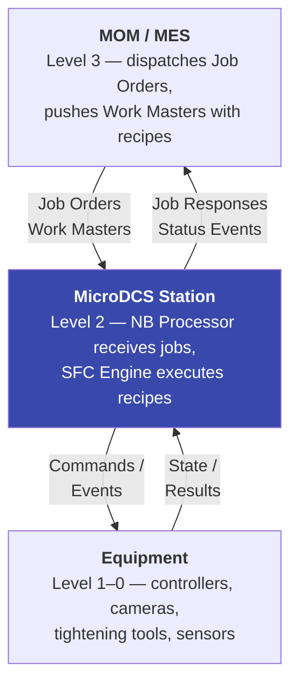
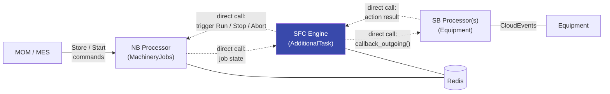
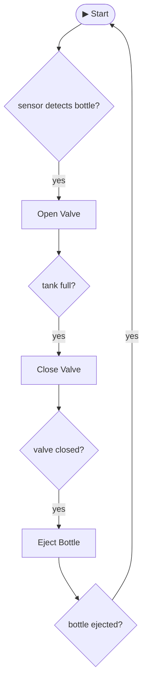

# SFC Engine

This page describes the design and implementation plan for the SFC (Sequential Function Chart) engine — a station-level execution layer that bridges the northbound OPC UA Job Management interface with southbound equipment interactions.

> **What is SFC?** If you are unfamiliar with Sequential Function Chart (SFC) concepts, see the [Sequential Function Charts (SFCs)](#sequential-function-charts-sfcs) section at the end of this document.

## Problem Statement

The existing `MachineryJobsCloudEventProcessor` implements the OPC UA Machinery Job Management state machine. It handles Store, StoreAndStart, Start, Pause, Resume, Stop, Abort, Cancel, and Clear commands from the MES/MOM layer and manages job state transitions in Redis. However, the transition from `AllowedToStart` to `Running` — and everything that happens while running — is intentionally left open. The OPC UA specification treats this as an implementation detail.

MicroDCS sits at ISA-95 Level 2 (station/cell control). A station can involve:

- Arbitrary complexity of parallel operations (e.g. QA camera checks running alongside fitting/tightening sequences)
- Two distinct equipment interaction patterns: equipment that pulls work via request/response events, and equipment that publishes state and receives pushed commands
- Recipe-driven execution where the recipe content comes from the MOM layer as part of the Work Master

The SFC engine fills this gap by interpreting Work Master recipe content to orchestrate equipment interactions within a station, using IEC 61131-3 SFC semantics.

## ISA-95 Level Scoping

MicroDCS operates at Level 2 — a single station or cell. It receives fully-resolved Job Orders from MES (Level 3) and executes them locally. Line-level dispatching and routing across stations is the responsibility of the MES layer. The SFC engine does not attempt Level 3 orchestration.



## Extended Work Master

### Current State

Today, `ISA95WorkMasterDataType` carries only an ID, description, and parameters — the OPC UA envelope. The Job Order references Work Masters by ID, and the `WorkMasterDAO` stores them in Redis. The `MachineryJobsCloudEventProcessor` validates that referenced Work Master IDs exist via `is_member()` but never inspects their content.

### Design: Opaque Data Envelope

Following the CloudEvent pattern where `data` is opaque and `dataschema` identifies its structure, the Work Master is extended with two fields:

| Field | Type | Purpose |
|---|---|---|
| `data` | `dict[str, Any] \| list[Any] \| None` | Recipe content as JSON — structure defined by `dataschema` |
| `dataschema` | `str \| None` | URI identifying the schema that `data` adheres to |

This is implemented as `ISA95WorkMasterDataTypeExt` in `machinery_jobs_ext.py`, inheriting from the generated `ISA95WorkMasterDataType`. Both fields default to `None`, so Work Masters without recipe content remain valid.

The content format is always JSON. The `dataschema` URI discriminates the semantic type — the SFC recipe schema is one possible value, but the design is open to other recipe formats (BPMN subsets, proprietary schemas) without any changes to the Work Master envelope, the NB processor, or the DAO layer.

```python
@dataclass(kw_only=True)
class ISA95WorkMasterDataTypeExt(ISA95WorkMasterDataType):
    data: dict[str, Any] | list[Any] | None = None
    dataschema: str | None = None
```

### Work Master Delivery

Work Masters with recipe content are pushed from the MOM layer into MicroDCS via CloudEvents and stored in Redis through the existing `WorkMasterDAO`. The NB processor's `is_job_acceptable()` validation works unchanged — it checks Work Master ID membership but does not interpret recipe content.

The `WorkMasterDAO.retrieve()` method is updated to deserialize as `ISA95WorkMasterDataTypeExt`, which is backward-compatible since both new fields have `None` defaults. The `WorkMasterDAO.save()` type hint accepts `ISA95WorkMasterDataTypeExt` directly, ensuring the extended fields (`data`, `dataschema`) are serialized to Redis JSON when present.

> **Status**: Implemented. See `ISA95WorkMasterDataTypeExt` in `src/microdcs/models/machinery_jobs_ext.py` and updated `WorkMasterDAO` in `src/microdcs/redis.py`.

## Station Configuration Delivery

> **Status**: Implemented. Config data models in `src/microdcs/models/machinery_jobs_ext.py`, `method` extension on `CloudEvent` in `src/microdcs/common.py`, `JobAcceptanceConfigDAO` in `src/microdcs/redis.py`, and `@incoming` config handlers in `src/microdcs/processors/machinery_jobs.py`.

### Problem

The `MachineryJobsCloudEventProcessor.is_job_acceptable()` validates incoming Job Orders against seven configurable checks: max downloadable job orders, equipment IDs, material class IDs, material definition IDs, personnel IDs, physical asset IDs, and Work Master IDs. The corresponding DAOs exist (`EquipmentListDAO`, `MaterialClassListDAO`, `MaterialDefinitionListDAO`, `PersonnelListDAO`, `PhysicalAssetListDAO`, `WorkMasterDAO`) with `add_to_list()` / `remove_from_list()` / `is_member()` methods, but **there is no delivery mechanism** — these lists must be populated externally before any Job Order can pass validation.

Similarly, `max_downloadable_job_orders` is currently a code-configured value in `JobAcceptanceConfig`. In production, the MES/MOM layer controls how many concurrent jobs a station is allowed to hold, so this must also be updatable at runtime.

### Design: MOM-Pushed Configuration via CloudEvents

All station configuration — resource lists and operational parameters — is pushed from the MES/MOM layer into MicroDCS via CloudEvents on the NB processor, following the same pattern as Job Orders:

| Configuration | CloudEvent type | DAO | Operation |
|---|---|---|---|
| Equipment list | `com.github.aschamberger.ISA95-JOBCONTROL_V2.config.equipment.v1` | `EquipmentListDAO` | `add_to_list()` / `remove_from_list()` |
| Material class list | `com.github.aschamberger.ISA95-JOBCONTROL_V2.config.materialclass.v1` | `MaterialClassListDAO` | `add_to_list()` / `remove_from_list()` |
| Material definition list | `com.github.aschamberger.ISA95-JOBCONTROL_V2.config.materialdefinition.v1` | `MaterialDefinitionListDAO` | `add_to_list()` / `remove_from_list()` |
| Personnel list | `com.github.aschamberger.ISA95-JOBCONTROL_V2.config.personnel.v1` | `PersonnelListDAO` | `add_to_list()` / `remove_from_list()` |
| Physical asset list | `com.github.aschamberger.ISA95-JOBCONTROL_V2.config.physicalasset.v1` | `PhysicalAssetListDAO` | `add_to_list()` / `remove_from_list()` |
| Work Masters | `com.github.aschamberger.ISA95-JOBCONTROL_V2.config.workmaster.v1` | `WorkMasterDAO` | `save()` / `delete()` |
| Max downloadable job orders | `com.github.aschamberger.ISA95-JOBCONTROL_V2.config.jobacceptance.v1` | `JobAcceptanceConfigDAO` | `save()` / `delete()` |

Each configuration CloudEvent carries the ISA-95 resource data type(s) in its payload:

- **Equipment**: `ISA95EquipmentDataType` — validated field: `id`
- **Material**: `ISA95MaterialDataType` — validated fields: `material_class_id`, `material_definition_id`
- **Personnel**: `ISA95PersonnelDataType` — validated field: `id`
- **Physical asset**: `ISA95PhysicalAssetDataType` — validated field: `id`
- **Work Master**: `ISA95WorkMasterDataTypeExt` — stored with full content including `data` and `dataschema`
- **Job acceptance**: simple payload with `max_downloadable_job_orders: int`

All configuration is scoped — the CloudEvent `subject` carries the scope, and each DAO operates per-scope. This allows different stations (scopes) to have different allowed resource sets.

### Operation Semantics

Configuration CloudEvents use the `method` CloudEvent extension attribute to distinguish upsert from delete, following HTTP-style semantics:

| `method` | Behavior |
|---|---|
| `PUT` (default when absent) | Add the resource ID(s) to the list / store the Work Master / set the config value |
| `DELETE` | Remove the resource ID(s) from the list / delete the Work Master / remove the config value |

Every configuration event is an **upsert** by default — if no `method` is present, the handler treats it as `PUT`. This allows the MES layer to incrementally update resource lists without full replacement. A full sync is achieved by clearing and re-adding (the MES layer's responsibility).

The `method` field is mapped to the `ce_method` keyword argument in `@incoming` handlers via `CloudeventAttributeTuple("ce_method", "method")` to avoid a name collision with the OPC UA `method` positional parameter used in existing Job Management handlers.

### Prerequisite Relationship

Station configuration delivery is a prerequisite for SFC engine execution — jobs cannot be accepted (and therefore cannot reach `AllowedToStart` or `Running`) until the resource lists and Work Masters are populated. This is why configuration delivery is implemented early in the plan, before the SFC engine itself.

## SFC Recipe Schema

> **Status**: Implemented. JSON Schema in `schemas/sfc_recipe.schema.json`, generated dataclasses in `src/microdcs/models/sfc_recipe.py`, `SFC_RECIPE_DATASCHEMA` constant in `src/microdcs/models/sfc_recipe_ext.py`.

The recipe schema uses IEC 61131-3 SFC terminology and semantics without the graphical/PLC baggage of PLCopen TC6 XML. It is defined as a JSON Schema (`sfc_recipe.schema.json`) and follows the existing code generation pipeline.

### Why Not PLCopen TC6 XML Directly

PLCopen TC6 is a graphical exchange format for PLC IDEs. Its XSD defines SFC elements (`step`, `transition`, `actionBlock`, `selectionDivergence`, `simultaneousDivergence`) but embeds them in ~80% graphical metadata (x/y coordinates, connection routing, pin positions). Transition conditions and action bodies contain opaque PLC source code (Structured Text, FBD, Ladder Diagram) that cannot execute in Python. Generating dataclasses from the TC6 XSD would produce a PLC file parser, not a sequence execution model.

The SFC recipe schema takes the standardized SFC constructs and expresses them as a runtime/recipe definition suitable for the MicroDCS event-driven architecture.

### Core Elements

The schema defines these top-level structures using IEC 61131-3 SFC terminology:

#### Step

A named step in the sequence. Steps are the states of the SFC state machine.

| Field | Type | Description |
|---|---|---|
| `name` | string | Unique step identifier |
| `initial` | boolean | Whether this is the initial step (exactly one per recipe) |

#### Transition

A directed edge between steps (or branch constructs). Transitions carry conditions that determine when execution advances.

| Field | Type | Description |
|---|---|---|
| `source` | string | Source step or branch name |
| `target` | string | Target step or branch name |
| `condition` | string | Condition identifier — resolved at runtime |
| `priority` | integer | Priority for selection divergence (lower = higher priority) |

#### Action Association

Associates an action with a step, including the interaction pattern and IEC 61131-3 action qualifier.

| Field | Type | Description |
|---|---|---|
| `name` | string | Action identifier |
| `qualifier` | enum | IEC 61131-3 action qualifier: `N` (non-stored), `P` (pulse), `P0`/`P1` (falling/rising edge), `S` (set/stored), `R` (reset), `L` (time limited), `D` (time delayed) |
| `interaction` | enum | `push_command` or `pull_event` — see [Equipment Interaction Patterns](#equipment-interaction-patterns) |
| `cloudevent_type` | string | CloudEvent type for the outgoing command or expected incoming event |
| `timeout_seconds` | integer | Maximum wait time before expiration handling |
| `parameters` | object | Step-specific parameters passed to the action |

#### Selection Branch

OR-branching: one of N paths is taken based on transition priorities/conditions.

| Field | Type | Description |
|---|---|---|
| `name` | string | Branch identifier (used as source/target in transitions) |
| `type` | `"selection"` | Discriminator |
| `branches` | list[list[string]] | Each inner list is a sequence of step names forming one branch |

#### Simultaneous Branch

AND-branching: all N paths execute in parallel and must all complete before convergence.

| Field | Type | Description |
|---|---|---|
| `name` | string | Branch identifier (used as source/target in transitions) |
| `type` | `"simultaneous"` | Discriminator |
| `branches` | list[list[string]] | Each inner list is a sequence of step names forming one parallel branch |

### Equipment Interaction Patterns

Each SFC action declares its interaction pattern, reflecting the two real-world scenarios:

| Pattern | `interaction` value | MicroDCS mechanism | Example |
|---|---|---|---|
| Equipment pulls work | `pull_event` | SFC engine activates the step, waits for a southbound CloudEventProcessor call matching CloudEvent `cloudevent_type` | Device asks for new task, processor responds with task and corresponding details  |
| Station pushes commands | `push_command` | SFC engine calls southbound CloudEventProcessor | Processor sends tighten command to tightening controller |

### Example Recipe

Rear axle fitting station with parallel QA check:

```json
{
  "steps": [
    { "name": "Init", "initial": true },
    { "name": "Positioning" },
    { "name": "TightenBolts" },
    { "name": "QaCheck" },
    { "name": "VerifyTorque" },
    { "name": "Complete" }
  ],
  "branches": [
    {
      "name": "FitAndQa",
      "type": "simultaneous",
      "branches": [
        ["Positioning", "TightenBolts"],
        ["QaCheck"]
      ]
    }
  ],
  "transitions": [
    { "source": "Init", "target": "FitAndQa", "condition": "always" },
    { "source": "FitAndQa", "target": "VerifyTorque", "condition": "always" },
    { "source": "VerifyTorque", "target": "Complete", "condition": "torque_ok" }
  ],
  "actions": [
    {
      "name": "position_axle",
      "step": "Positioning",
      "qualifier": "N",
      "interaction": "push_command",
      "cloudevent_type": "com.example.station.position.v1",
      "timeout_seconds": 30
    },
    {
      "name": "tighten",
      "step": "TightenBolts",
      "qualifier": "N",
      "interaction": "push_command",
      "cloudevent_type": "com.example.station.tighten.v1",
      "timeout_seconds": 60,
      "parameters": { "torque_spec": "85Nm" }
    },
    {
      "name": "camera_qa",
      "step": "QaCheck",
      "qualifier": "N",
      "interaction": "pull_event",
      "cloudevent_type": "com.example.station.qa_result.v1",
      "timeout_seconds": 45
    },
    {
      "name": "verify",
      "step": "VerifyTorque",
      "qualifier": "N",
      "interaction": "pull_event",
      "cloudevent_type": "com.example.station.torque_result.v1",
      "timeout_seconds": 15
    }
  ]
}
```

This recipe would be stored in the Work Master as:

```python
ISA95WorkMasterDataTypeExt(
    id="WM-AXLE-FIT-001",
    description=LocalizedText(text="Rear axle fitting and QA"),
    parameters=[ISA95ParameterDataType(name="torque_spec", value="85Nm")],
    data={...},  # the recipe JSON above
    dataschema="https://aschamberger.github.io/schemas/microdcs/sfc-recipe/v1.0.0/",
)
```

### Generated Dataclasses

The JSON Schema is processed through the standard code generation pipeline:

```bash
uv run microdcs dataclassgen dataclasses sfc_recipe.schema.json
```

This generates `src/microdcs/models/sfc_recipe.py` with:

| Generated type | Kind | Description |
|---|---|---|
| `SfcActionQualifier` | `StrEnum` | IEC 61131-3 action qualifiers (`N`, `P`, `P0`, `P1`, `S`, `R`, `L`, `D`) |
| `SfcInteraction` | `StrEnum` | Equipment interaction patterns (`push_command`, `pull_event`) |
| `SfcBranchType` | `StrEnum` | Branch types (`selection`, `simultaneous`) |
| `SfcStep` | `@dataclass` | Step with `name` and `initial` flag |
| `SfcTransition` | `@dataclass` | Transition with `source`, `target`, `condition`, `priority` |
| `SfcActionAssociation` | `@dataclass` | Action binding with `step`, `qualifier`, `interaction`, `cloudevent_type`, `timeout_seconds`, `parameters` |
| `SfcBranch` | `@dataclass` | Branch construct with `name`, `type`, `branches` |
| `SfcRecipe` | `@dataclass` | Top-level recipe containing `steps`, `transitions`, `actions`, `branches` |

The `SfcRecipe.Config` class carries:

- `cloudevent_type`: `com.github.aschamberger.microdcs.sfc-recipe.v1`
- `cloudevent_dataschema`: `https://aschamberger.github.io/schemas/microdcs/sfc-recipe/v1.0.0/SfcRecipe/`

A hand-written `sfc_recipe_ext.py` provides the `SFC_RECIPE_DATASCHEMA` constant — the schema `$id` URI (`https://aschamberger.github.io/schemas/microdcs/sfc-recipe/v1.0.0/`) used as the `dataschema` value on `ISA95WorkMasterDataTypeExt` to identify SFC recipe payloads. The SFC engine dispatches on this URI to select the recipe interpreter.

## SFC Engine Architecture

### Role in the System

The SFC engine is **not** a `CloudEventProcessor`. It is a separate orchestration layer that sits between the northbound and southbound processors and interacts with them via direct Python method calls — not CloudEvent round-trips. This separates three distinct concerns:

| Layer | Responsibility | Abstraction |
|---|---|---|
| **NB protocol** | OPC UA Job Management state machine, CloudEvent serialization, MQTT topics | `MachineryJobsCloudEventProcessor` |
| **SFC orchestration** | Recipe interpretation, step sequencing, branching, action dispatch | `SfcEngine` (`AdditionalTask`) |
| **SB protocol** | Equipment-specific CloudEvent shaping, transport binding | Equipment `CloudEventProcessor`(s) |

The engine holds references to the NB processor (to trigger `Run` / state transitions) and the SB processor(s) (to call `callback_outgoing()` and receive results). SB processors retain their full `@incoming` / `@outgoing` interface and can be used independently for testing or manual triggering.



Dashed arrows are direct Python method calls within the same process. Solid arrows are CloudEvent messages over protocol transports (MQTT, MessagePack-RPC). The SFC engine never touches serialization, topic structures, or transport concerns.

### Execution Flow

1. **Job arrives**: MES sends `Store` or `StoreAndStart` → NB processor transitions job to `NotAllowedToStart` or `AllowedToStart`
2. **SFC engine picks up**: The NB processor notifies the SFC engine via a direct method call (or the engine polls Redis) when a job is ready to run. The engine:
    - Loads the Job Order from Redis
    - Resolves the Work Master ID → loads the extended Work Master with recipe from Redis
    - Dispatches on `dataschema` to select the recipe interpreter
    - Deserializes `data` into SFC recipe dataclasses
3. **Triggers Run**: The engine calls `trigger()` on the NB processor's `HierarchicalGraphMachine` to transition the job to `Running`, then persists the state change
4. **Walks the SFC**:
    - Steps map to states in the `transitions` library
    - For `push_command` actions: calls the SB processor's `callback_outgoing()` directly with the action's CloudEvent type and parameters, then awaits the result or timeout
    - For `pull_event` actions: registers interest with the SB processor and waits for it to deliver a matching incoming event via callback
    - Simultaneous branches execute via `asyncio.TaskGroup` — all branches must complete before convergence
    - Selection branches evaluate transition conditions/priorities to pick one path
5. **Completes**: On recipe completion, triggers the NB job state to `Ended_Completed` via direct call and writes the `ISA95JobResponseDataType`
6. **Handles failures**: On timeout, equipment error, or abort — triggers `Ended_Aborted` or `Aborted` on the NB processor as appropriate

### State Machine Integration

The SFC recipe steps map to the `transitions` library, reusing the same `HierarchicalGraphMachine` pattern as the OPC UA job state machine:

| SFC concept | `transitions` mapping |
|---|---|
| Step | State |
| Transition | Trigger with guard (condition) |
| Simultaneous branch | `HierarchicalGraphMachine` parallel states |
| Selection branch | Multiple transitions from same source, evaluated by priority |
| Action qualifier | `on_enter` / `on_exit` callbacks on states |

The SFC state machine is separate from the OPC UA job state machine. The SFC engine manages both:

- The **OPC UA state machine** (job lifecycle: `AllowedToStart` → `Running` → `Ended`) via the existing `HierarchicalGraphMachine` in the NB processor
- The **SFC state machine** (recipe execution: step → transition → step) as a second machine instance for the recipe

### Persistence

The SFC engine persists its execution state in Redis so that recipe execution can survive pod restarts:

- Current step(s) and active branch states
- Pending action completion status
- Job-to-recipe association

This builds on the existing Redis JSON persistence pattern used by `JobOrderAndStateDAO`.

## Implementation Plan

### Phase 1: Extended Work Master

**Goal**: Enable Work Masters to carry recipe content without changing the NB processor.

1. Add `ISA95WorkMasterDataTypeExt` to `machinery_jobs_ext.py` with `data` and `dataschema` fields
2. Update `WorkMasterDAO.retrieve()` to deserialize as `ISA95WorkMasterDataTypeExt`
3. Update `WorkMasterDAO.save()` type hint to accept the ext type
4. Add unit tests for serialization roundtrip with and without recipe data
5. Update existing `WorkMasterDAO` tests for the new return type
6. Update this document's "Extended Work Master" section with final field names and code snippets
7. Update `docs/concepts.md`: add "Extended Work Master" to the ISA-95 Job Management section explaining the opaque data envelope; add glossary entries for **Work Master**, **Extended Work Master**, **`dataschema` (Work Master)**
8. Update `docs/information-model-standards.md`: add "Extended Work Master (ISA95WorkMasterDataTypeExt)" subsection after OPC UA / Machinery Job Management with field table, code snippet, and DAO behavior

### Phase 2: Station Configuration Delivery

**Goal**: Enable MOM to push station configuration (resource lists, Work Masters, operational parameters) into MicroDCS via CloudEvents.

1. ~~Define CloudEvent data models for each configuration type~~ — Done: thin subclasses (`ConfigEquipment`, `ConfigMaterialClass`, `ConfigMaterialDefinition`, `ConfigPersonnel`, `ConfigPhysicalAsset`, `ConfigWorkMaster`, `ConfigJobAcceptance`) in `machinery_jobs_ext.py`
2. ~~Add `method` CloudEvent extension attribute~~ — Done: `method: str | None = None` on `CloudEvent`; mapped to `ce_method` kwarg in handlers via `CloudeventAttributeTuple`
3. ~~Add `@incoming` handlers for each configuration CloudEvent type~~ — Done: 7 handlers on `MachineryJobsCloudEventProcessor`, each dispatching to the corresponding DAO based on `ce_method` (`PUT` / `DELETE`)
4. ~~Add `JobAcceptanceConfigDAO`~~ — Done: persists per-scope `max_downloadable_job_orders` in Redis; `is_job_acceptable()` queries it for scope-specific override, falling back to the code-configured default
5. ~~Add unit tests~~ — Done: `TestJobAcceptanceConfigDAO` in `test_redis.py`, config handler tests and scoped acceptance tests in `test_machinery_jobs_processor.py`
6. ~~Update docs~~ — Done: `sfc_engine.md`, `concepts.md`, `information-model-standards.md`, `persistence.md`

### Phase 3: SFC Recipe Schema and Dataclasses

**Goal**: Define the recipe format and generate typed dataclasses.

1. ~~Create `schemas/sfc_recipe.schema.json` with steps, transitions, actions, branches~~ — Done: schema defines `SfcStep`, `SfcTransition`, `SfcActionAssociation`, `SfcBranch`, `SfcRecipe` with enums `SfcActionQualifier`, `SfcInteraction`, `SfcBranchType`
2. ~~Generate dataclasses via `dataclassgen`: `sfc_recipe.py` in `models/`~~ — Done: `uv run microdcs dataclassgen dataclasses sfc_recipe.schema.json`
3. ~~Create `sfc_recipe_mixin.py` if needed for `transitions` library integration~~ — Not needed: pure data models with no `__post_init__` or state machine logic
4. ~~Add the SFC recipe `dataschema` URI constant~~ — Done: `SFC_RECIPE_DATASCHEMA` in `sfc_recipe_ext.py`
5. ~~Update `models/__init__.py` exports~~ — Done: added `sfc_recipe` and `sfc_recipe_ext` imports
6. ~~Add unit tests for recipe dataclass serialization/deserialization~~ — Done: `test_sfc_recipe.py` with JSON/msgpack roundtrips, full example recipe, enum values, and config attributes
7. ~~Update this document's "SFC Recipe Schema" section with the final JSON Schema and generated dataclass details~~ — Done
8. ~~Update `docs/concepts.md`~~ — Done: added glossary entries for SFC recipe, step, transition, action association, action qualifier, selection/simultaneous branch, `push_command`, `pull_event`
9. ~~Update `docs/information-model-standards.md`~~ — Done: added "SFC Recipe Schema" subsection
10. ~~Update `docs/technical-standards.md`~~ — Done: added "IEC 61131-3 SFC" section
11. ~~Update `docs/development.md`~~ — Done: added SFC recipe generation command

### Phase 4: SFC Engine (Core)

**Goal**: Implement the basic sequential execution engine as an `AdditionalTask`.

1. Create `src/microdcs/sfc_engine.py` with `SfcEngine(AdditionalTask)`
2. Accept NB processor and SB processor references via constructor injection
3. Implement recipe loading: Job Order → Work Master ID → Redis → recipe deserialization dispatched by `dataschema`
4. Implement `Run` trigger on the NB processor's `HierarchicalGraphMachine` via direct call
5. Implement linear step execution (no branching): step entry → action dispatch → wait for completion → transition evaluation → next step
6. Implement `push_command` action pattern: call SB processor's `callback_outgoing()` directly + response/timeout handling
7. Implement `pull_event` action pattern: register with SB processor for incoming event delivery + step completion signaling
8. Implement job completion: `Ended_Completed` state transition on NB processor + `ISA95JobResponseDataType`
9. Implement job failure: timeout → `Ended_Aborted`, equipment error → `Aborted` via NB processor
10. Add Redis persistence for execution state
11. Add unit tests with mocked processors and Redis
12. Update this document's "SFC Engine Architecture" section with final class design, method signatures, and persistence schema
13. Update `docs/concepts.md`: add a new "SFC Engine" section under Framework Concepts explaining the three-layer architecture (NB protocol → SFC orchestration → SB protocol) and the `AdditionalTask` base; add glossary entries for **SFC engine**, **AdditionalTask**, **Three-layer architecture**
14. Update `docs/overall-design.md`: add "Three-Layer Architecture" subsection describing the NB protocol / SFC orchestration / SB protocol layer separation
15. Update `docs/persistence.md`: expand key schema table with SFC execution state keys; add "SFC Execution State" section documenting `SfcExecutionDAO` and `ActionStateDAO` with usage examples
16. Update `docs/your-first-processor.md`: add note in overview that processors are stateless protocol adapters and point to SFC Engine docs for multi-step orchestration

### Phase 5: Branching

**Goal**: Add parallel and selection branching support.

1. Implement simultaneous (AND) branches via `asyncio.TaskGroup`
2. Implement selection (OR) branches via priority-based transition evaluation
3. Implement convergence logic (simultaneous: all must complete; selection: first wins)
4. Add unit tests for branching scenarios
5. Update this document's "State Machine Integration" section with final branching implementation details
6. Update `docs/concepts.md`: expand the SFC Engine section with branching semantics (simultaneous/selection divergence and convergence)

### Phase 6: Application Wiring

**Goal**: Integrate into the example application.

1. Instantiate `SfcEngine` in `app/__main__.py`, injecting the NB and SB processor references
2. Register via `microdcs.add_additional_task(sfc_engine)` — the engine runs as a long-lived task within the `SystemEventTaskGroup` and monitors `_shutdown_event` for graceful shutdown
3. SB processors are still registered with their own protocol bindings as usual — the engine calls them directly, it does not replace their transport wiring
4. Create example Work Master with SFC recipe for testing
5. Integration test with MQTT broker and Redis
6. Update `docs/your-first-processor.md`: add "SFC Engine Integration" subsection in "Wire It Up" explaining that the engine calls processors directly and showing wiring example
7. Update `docs/development.md`: add SFC engine runtime wiring example (`SfcEngine` instantiation + `add_additional_task`)
8. Update `docs/index.md`: add SFC Engine to the "Start Here" reading path and mention recipe-driven station orchestration in the overview

## Design Decisions

- **Opaque `data` + `dataschema` on Work Master**: Follows the CloudEvent envelope pattern. The NB processor and DAO stay ignorant of recipe content. Any future recipe format can be added by defining a new `dataschema` URI without touching existing code.
- **JSON only for `data`**: The Work Master lives in Redis JSON. Keeping `data` as a JSON-native structure (`dict | list`) avoids base64 encoding and enables Redis JSON path queries into recipe content if needed.
- **SFC engine as a separate orchestration layer, not a processor**: The engine is an `AdditionalTask`, not a `CloudEventProcessor`. This enforces a clean three-layer separation: NB protocol handling → SFC orchestration → SB protocol handling. The engine interacts with processors via direct Python method calls within the same process, avoiding CloudEvent round-trips for internal orchestration. This keeps the NB processor as a pure OPC UA protocol handler and SB processors as pure equipment protocol handlers — neither needs to know about SFC concepts. The engine can be replaced with a different execution strategy without changing any processor code.
- **`transitions` library reuse**: The `HierarchicalGraphMachine` is already proven in the codebase for the OPC UA job state machine. SFC steps/transitions map naturally to its states/triggers model.
- **IEC 61131-3 SFC terminology**: Uses standardized names (step, transition, action, qualifier, selection/simultaneous divergence) from IEC 61131-3 without adopting the PLCopen TC6 graphical exchange format.
- **Two interaction patterns**: `push_command` and `pull_event` cover the two real-world equipment integration scenarios observed in discrete manufacturing (automotive). The pattern is declared per action in the recipe, not globally.
- **Station configuration delivery before SFC engine**: Resource lists (equipment, material, personnel, physical asset), Work Masters, and operational parameters (max downloadable orders) are all prerequisites for job acceptance. Without populated lists, `is_job_acceptable()` rejects every Job Order and no job ever reaches `AllowedToStart`. Configuration delivery is therefore Phase 2 — after the Work Master extension (Phase 1) but before the SFC engine (Phase 4). This also means the MES/MOM layer owns the station's allowed resource set, which matches the ISA-95 Level 3 → Level 2 responsibility split.
- **`method` extension attribute for PUT/DELETE**: Using an HTTP-style `method` CloudEvent extension attribute to distinguish upsert vs. delete keeps the payload structure identical for both operations. `PUT` (the default when `method` is absent) performs an upsert; `DELETE` removes the resource. Incremental updates (add one equipment ID, remove one) avoid the complexity of full-replacement semantics and allow the MES layer to manage resource lists without MicroDCS needing to reconcile diffs. The attribute is mapped to `ce_method` in handler kwargs to avoid a name collision with the OPC UA `method` positional parameter.

## Sequential Function Charts (SFCs)

A **Sequential Function Chart** is a graphical programming language used primarily in industrial automation and PLC (Programmable Logic Controller) programming to describe the sequential behavior of a control system. It's one of the five languages defined in the **IEC 61131-3** standard.

The core idea is simple: a complex process is broken into a series of **steps** connected by **transitions**, making it easy to visualize and reason about the order in which things happen.

### The Three Building Blocks

**1. Steps (Rectangles)**
A step represents a stable *state* the system is in — a moment where certain actions are being performed. At any given time, one or more steps are "active." Each step can have actions associated with it (e.g., "run motor," "open valve").

**2. Transitions (Horizontal Lines)**
A transition sits between steps and defines the *condition* that must be true before the system moves forward. It acts as a gate — once the condition is met (e.g., a sensor reading, a timer expiring, a button press), the current step deactivates and the next one activates.

**3. Actions**
Actions are the actual work tied to a step. They can be qualified — for example, an action might run only once when a step activates, run continuously while the step is active, or persist even after the step ends.

### Key Structural Patterns

- **Sequence** — Steps execute one after another in a straight line.
- **Selection branch (OR)** — Multiple possible paths forward; the first transition that becomes true is taken.
- **Parallel branch (AND)** — Multiple paths execute *simultaneously*, and all must complete before converging again.
- **Loops** — A transition can point back to an earlier step, creating repetition.

### Why Use SFCs?

- **Readability** — The flowchart-like visual makes it easy for engineers and technicians to understand a process at a glance.
- **Modularity** — Complex behavior is decomposed into clean, manageable steps.
- **Debugging** — You can watch which step is currently active in real time, making it much easier to spot where a process gets stuck.
- **Standardization** — Being part of IEC 61131-3, SFCs are supported across many industrial platforms (Siemens, Rockwell, Beckhoff, etc.).

> While SFCs are the ultimate tool for macro-level orchestration, the actual micro-level logic — what specifically turns on inside a Step, or the exact boolean math inside a Transition — is almost always written in another IEC 61131-3 language, like Structured Text or Ladder Diagram. SFC acts as the skeleton and project manager of a program; the other languages do the heavy lifting inside.

### A Simple Example

Imagine a bottle-filling machine:
<div style="width: 30%; margin: auto;">


</div>
Each rectangle is a **step**, each diamond is a **transition condition**. The logic is immediately obvious just from looking at it — no need to trace through nested `if` statements in code.

SFCs are essentially a **state machine** expressed visually, and they shine whenever a process is inherently sequential — manufacturing lines, batch processing, robotics, and anywhere you need reliable, inspectable control logic.