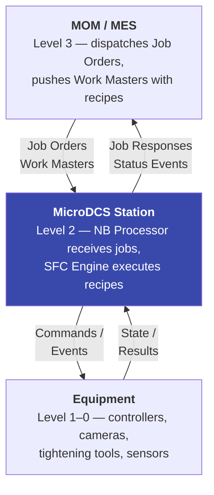
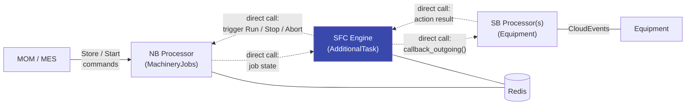
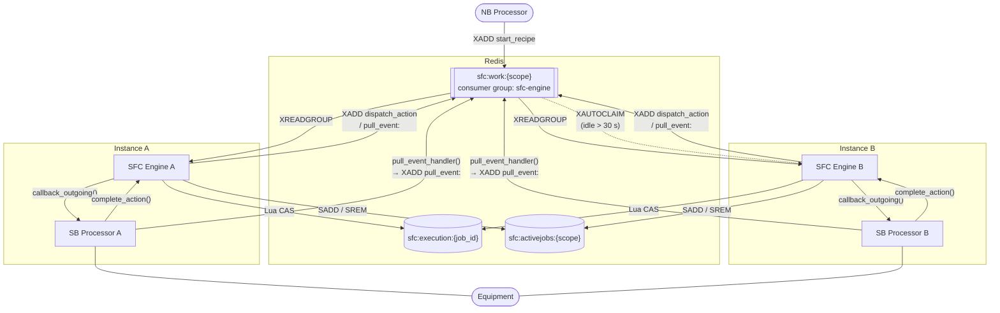
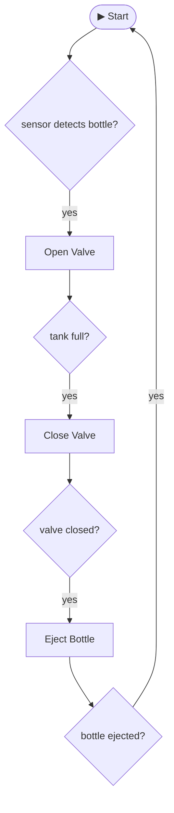

# SFC Engine

This page describes the design and implementation plan for the SFC (Sequential Function Chart) engine — a station-level execution layer that bridges the northbound OPC UA Job Management interface with southbound equipment interactions.

> **What is SFC?** If you are unfamiliar with Sequential Function Chart (SFC) concepts, see the [Sequential Function Charts (SFCs)](#sequential-function-charts-sfcs) section at the end of this document.

## Problem Statement

The existing `MachineryJobsCloudEventProcessor` implements the OPC UA Machinery Job Management state machine. It handles Store, StoreAndStart, Start, Pause, Resume, Stop, Abort, Cancel, and Clear commands from the MES/MOM layer and manages job state transitions in Redis. However, the transition from `AllowedToStart` to `Running` — and everything that happens while running — is intentionally left open. The OPC UA specification treats this as an implementation detail.

MicroDCS sits at ISA-95 Level 2 (station/cell control). A station can involve:

- Arbitrary complexity of parallel operations (e.g. QA camera checks running alongside fitting/tightening sequences)
- Two distinct equipment interaction patterns: equipment that pulls work via request/response events, and equipment that publishes state and receives pushed commands
- Recipe-driven execution where the recipe content comes from the MOM layer as part of the Work Master

The SFC engine fills this gap by interpreting Work Master recipe content to orchestrate equipment interactions within a station, using IEC 61131-3 SFC semantics.

## ISA-95 Level Scoping

MicroDCS operates at Level 2 — a single station or cell. It receives fully-resolved Job Orders from MES (Level 3) and executes them locally. Line-level dispatching and routing across stations is the responsibility of the MES layer. The SFC engine does not attempt Level 3 orchestration.


```mermaid
flowchart TB
  mom["<b>MOM / MES</b><br/>Level 3 — dispatches Job Orders,<br/>pushes Work Masters with recipes"]
  microdcs["<b>MicroDCS Station</b><br/>Level 2 — NB Processor receives jobs,<br/>SFC Engine executes recipes"]
  equipment["<b>Equipment</b><br/>Level 1–0 — controllers, cameras,<br/>tightening tools, sensors"]

  mom -- "Job Orders<br/>Work Masters" --> microdcs
  microdcs -- "Job Responses<br/>Status Events" --> mom
  microdcs -- "Commands /<br/>Events" --> equipment
  equipment -- "State /<br/>Results" --> microdcs

  style microdcs fill:#3949ab,color:#fff
```

## Extended Work Master

### Current State

Today, `ISA95WorkMasterDataType` carries only an ID, description, and parameters — the OPC UA envelope. The Job Order references Work Masters by ID, and the `WorkMasterDAO` stores them in Redis. The `MachineryJobsCloudEventProcessor` validates that referenced Work Master IDs exist via `is_member()` but never inspects their content.

### Design: Opaque Data Envelope

Following the CloudEvent pattern where `data` is opaque and `dataschema` identifies its structure, the Work Master is extended with two fields:

| Field | Type | Purpose |
|---|---|---|
| `data` | `dict[str, Any] \| list[Any] \| None` | Recipe content as JSON — structure defined by `dataschema` |
| `dataschema` | `str \| None` | URI identifying the schema that `data` adheres to |

This is implemented as `ISA95WorkMasterDataTypeExt` in `machinery_jobs_ext.py`, inheriting from the generated `ISA95WorkMasterDataType`. Both fields default to `None`, so Work Masters without recipe content remain valid.

The content format is always JSON. The `dataschema` URI discriminates the semantic type — the SFC recipe schema is one possible value, but the design is open to other recipe formats (BPMN subsets, proprietary schemas) without any changes to the Work Master envelope, the NB processor, or the DAO layer.

```python
@dataclass(kw_only=True)
class ISA95WorkMasterDataTypeExt(ISA95WorkMasterDataType):
    data: dict[str, Any] | list[Any] | None = None
    dataschema: str | None = None
```

### Work Master Delivery

Work Masters with recipe content are pushed from the MOM layer into MicroDCS via CloudEvents and stored in Redis through the existing `WorkMasterDAO`. The NB processor's `is_job_acceptable()` validation works unchanged — it checks Work Master ID membership but does not interpret recipe content.

The `WorkMasterDAO.retrieve()` method is updated to deserialize as `ISA95WorkMasterDataTypeExt`, which is backward-compatible since both new fields have `None` defaults. The `WorkMasterDAO.save()` type hint accepts `ISA95WorkMasterDataTypeExt` directly, ensuring the extended fields (`data`, `dataschema`) are serialized to Redis JSON when present.

> **Status**: Implemented. See `ISA95WorkMasterDataTypeExt` in `src/microdcs/models/machinery_jobs_ext.py` and updated `WorkMasterDAO` in `src/microdcs/redis.py`.

## Station Configuration Delivery

> **Status**: Implemented. Config data models in `src/microdcs/models/machinery_jobs_ext.py`, `method` extension on `CloudEvent` in `src/microdcs/common.py`, `JobAcceptanceConfigDAO` in `src/microdcs/redis.py`, and `@incoming` config handlers in `src/microdcs/processors/machinery_jobs.py`.

### Problem

The `MachineryJobsCloudEventProcessor.is_job_acceptable()` validates incoming Job Orders against seven configurable checks: max downloadable job orders, equipment IDs, material class IDs, material definition IDs, personnel IDs, physical asset IDs, and Work Master IDs. The corresponding DAOs exist (`EquipmentListDAO`, `MaterialClassListDAO`, `MaterialDefinitionListDAO`, `PersonnelListDAO`, `PhysicalAssetListDAO`, `WorkMasterDAO`) with `add_to_list()` / `remove_from_list()` / `is_member()` methods, but **there is no delivery mechanism** — these lists must be populated externally before any Job Order can pass validation.

Similarly, `max_downloadable_job_orders` is currently a code-configured value in `JobAcceptanceConfig`. In production, the MES/MOM layer controls how many concurrent jobs a station is allowed to hold, so this must also be updatable at runtime.

### Design: MOM-Pushed Configuration via CloudEvents

All station configuration — resource lists and operational parameters — is pushed from the MES/MOM layer into MicroDCS via CloudEvents on the NB processor, following the same pattern as Job Orders:

| Configuration | CloudEvent type | DAO | Operation |
|---|---|---|---|
| Equipment list | `com.github.aschamberger.ISA95-JOBCONTROL_V2.config.equipment.v1` | `EquipmentListDAO` | `add_to_list()` / `remove_from_list()` |
| Material class list | `com.github.aschamberger.ISA95-JOBCONTROL_V2.config.materialclass.v1` | `MaterialClassListDAO` | `add_to_list()` / `remove_from_list()` |
| Material definition list | `com.github.aschamberger.ISA95-JOBCONTROL_V2.config.materialdefinition.v1` | `MaterialDefinitionListDAO` | `add_to_list()` / `remove_from_list()` |
| Personnel list | `com.github.aschamberger.ISA95-JOBCONTROL_V2.config.personnel.v1` | `PersonnelListDAO` | `add_to_list()` / `remove_from_list()` |
| Physical asset list | `com.github.aschamberger.ISA95-JOBCONTROL_V2.config.physicalasset.v1` | `PhysicalAssetListDAO` | `add_to_list()` / `remove_from_list()` |
| Work Masters | `com.github.aschamberger.ISA95-JOBCONTROL_V2.config.workmaster.v1` | `WorkMasterDAO` | `save()` / `delete()` |
| Max downloadable job orders | `com.github.aschamberger.ISA95-JOBCONTROL_V2.config.jobacceptance.v1` | `JobAcceptanceConfigDAO` | `save()` / `delete()` |

Each configuration CloudEvent carries the ISA-95 resource data type(s) in its payload:

- **Equipment**: `ISA95EquipmentDataType` — validated field: `id`
- **Material**: `ISA95MaterialDataType` — validated fields: `material_class_id`, `material_definition_id`
- **Personnel**: `ISA95PersonnelDataType` — validated field: `id`
- **Physical asset**: `ISA95PhysicalAssetDataType` — validated field: `id`
- **Work Master**: `ISA95WorkMasterDataTypeExt` — stored with full content including `data` and `dataschema`
- **Job acceptance**: simple payload with `max_downloadable_job_orders: int`

All configuration is scoped — the CloudEvent `subject` carries the scope, and each DAO operates per-scope. This allows different stations (scopes) to have different allowed resource sets.

### Operation Semantics

Configuration CloudEvents use the `method` CloudEvent extension attribute to distinguish upsert from delete, following HTTP-style semantics:

| `method` | Behavior |
|---|---|
| `PUT` (default when absent) | Add the resource ID(s) to the list / store the Work Master / set the config value |
| `DELETE` | Remove the resource ID(s) from the list / delete the Work Master / remove the config value |

Every configuration event is an **upsert** by default — if no `method` is present, the handler treats it as `PUT`. This allows the MES layer to incrementally update resource lists without full replacement. A full sync is achieved by clearing and re-adding (the MES layer's responsibility).

The `method` field is mapped to the `ce_method` keyword argument in `@incoming` handlers via `CloudeventAttributeTuple("ce_method", "method")` to avoid a name collision with the OPC UA `method` positional parameter used in existing Job Management handlers.

### Prerequisite Relationship

Station configuration delivery is a prerequisite for SFC engine execution — jobs cannot be accepted (and therefore cannot reach `AllowedToStart` or `Running`) until the resource lists and Work Masters are populated. This is why configuration delivery is implemented early in the plan, before the SFC engine itself.

## SFC Recipe Schema

> **Status**: Implemented. JSON Schema in `schemas/sfc_recipe.schema.json`, generated dataclasses in `src/microdcs/models/sfc_recipe.py`, `SFC_RECIPE_DATASCHEMA` constant in `src/microdcs/models/sfc_recipe_ext.py`.

The recipe schema uses IEC 61131-3 SFC terminology and semantics without the graphical/PLC baggage of PLCopen TC6 XML. It is defined as a JSON Schema (`sfc_recipe.schema.json`) and follows the existing code generation pipeline.

### Why Not PLCopen TC6 XML Directly

PLCopen TC6 is a graphical exchange format for PLC IDEs. Its XSD defines SFC elements (`step`, `transition`, `actionBlock`, `selectionDivergence`, `simultaneousDivergence`) but embeds them in ~80% graphical metadata (x/y coordinates, connection routing, pin positions). Transition conditions and action bodies contain opaque PLC source code (Structured Text, FBD, Ladder Diagram) that cannot execute in Python. Generating dataclasses from the TC6 XSD would produce a PLC file parser, not a sequence execution model.

The SFC recipe schema takes the standardized SFC constructs and expresses them as a runtime/recipe definition suitable for the MicroDCS event-driven architecture.

### Core Elements

The schema defines these top-level structures using IEC 61131-3 SFC terminology:

#### Step

A named step in the sequence. Steps are the states of the SFC state machine.

| Field | Type | Description |
|---|---|---|
| `name` | `string` | Unique step identifier |
| `initial` | `boolean` | Whether this is the initial step (exactly one per recipe) |

#### Transition

A directed edge between steps (or branch constructs). Transitions carry conditions that determine when execution advances.

| Field | Type | Description |
|---|---|---|
| `source` | `string` | Source step or branch name |
| `target` | `string` | Target step or branch name |
| `condition` | `string` | Condition identifier — resolved at runtime |
| `priority` | `integer` | Priority for selection divergence (lower = higher priority) |

#### Action Association

Associates an action with a step, including the interaction pattern and IEC 61131-3 action qualifier.

| Field | Type | Description |
|---|---|---|
| `name` | `string` | Action identifier |
| `qualifier` | `enum` | IEC 61131-3 action qualifier: `N` (non-stored), `P` (pulse), `P0`/`P1` (falling/rising edge), `S` (set/stored), `R` (reset), `L` (time limited), `D` (time delayed) |
| `interaction` | `enum` | `push_command` or `pull_event` — see [Equipment Interaction Patterns](#equipment-interaction-patterns) |
| `type_id` | `string` | Type identifier for the outgoing command or expected incoming event |
| `timeout_seconds` | `integer` | Maximum wait time before expiration handling |
| `parameters` | `object` | Step-specific parameters passed to the action |

#### Selection Branch

OR-branching: one of N paths is taken based on transition priorities/conditions.

| Field | Type | Description |
|---|---|---|
| `name` | `string` | Branch identifier (used as source/target in transitions) |
| `type` | `"selection"` | Discriminator |
| `branches` | `list[list[string]]` | Each inner list is a sequence of step names forming one branch |

#### Simultaneous Branch

AND-branching: all N paths execute in parallel and must all complete before convergence.

| Field | Type | Description |
|---|---|---|
| `name` | `string` | Branch identifier (used as source/target in transitions) |
| `type` | `"simultaneous"` | Discriminator |
| `branches` | `list[list[string]]` | Each inner list is a sequence of step names forming one parallel branch |

### Equipment Interaction Patterns

Each SFC action declares its interaction pattern, reflecting the two real-world scenarios:

| Pattern | `interaction` value | MicroDCS mechanism | Example |
|---|---|---|---|
| Equipment pulls work | `pull_event` | SFC engine activates the step, waits for a southbound CloudEventProcessor call matching CloudEvent `type_id` | Device asks for new task, processor responds with task and corresponding details  |
| Station pushes commands | `push_command` | SFC engine calls southbound CloudEventProcessor | Processor sends tighten command to tightening controller |

### Example Recipe

Rear axle fitting station with parallel QA check:

```json
{
  "steps": [
    { "name": "Init", "initial": true },
    { "name": "Positioning" },
    { "name": "TightenBolts" },
    { "name": "QaCheck" },
    { "name": "VerifyTorque" },
    { "name": "Complete" }
  ],
  "branches": [
    {
      "name": "FitAndQa",
      "type": "simultaneous",
      "branches": [
        ["Positioning", "TightenBolts"],
        ["QaCheck"]
      ]
    }
  ],
  "transitions": [
    { "source": "Init", "target": "FitAndQa", "condition": "always" },
    { "source": "FitAndQa", "target": "VerifyTorque", "condition": "always" },
    { "source": "VerifyTorque", "target": "Complete", "condition": "torque_ok" }
  ],
  "actions": [
    {
      "name": "position_axle",
      "step": "Positioning",
      "qualifier": "N",
      "interaction": "push_command",
      "type_id": "com.example.station.position.v1",
      "timeout_seconds": 30
    },
    {
      "name": "tighten",
      "step": "TightenBolts",
      "qualifier": "N",
      "interaction": "push_command",
      "type_id": "com.example.station.tighten.v1",
      "timeout_seconds": 60,
      "parameters": { "torque_spec": "85Nm" }
    },
    {
      "name": "camera_qa",
      "step": "QaCheck",
      "qualifier": "N",
      "interaction": "pull_event",
      "type_id": "com.example.station.qa_result.v1",
      "timeout_seconds": 45
    },
    {
      "name": "verify",
      "step": "VerifyTorque",
      "qualifier": "N",
      "interaction": "pull_event",
      "type_id": "com.example.station.torque_result.v1",
      "timeout_seconds": 15
    }
  ]
}
```

This recipe would be stored in the Work Master as:

```python
ISA95WorkMasterDataTypeExt(
    id="WM-AXLE-FIT-001",
    description=LocalizedText(text="Rear axle fitting and QA"),
    parameters=[ISA95ParameterDataType(name="torque_spec", value="85Nm")],
    data={...},  # the recipe JSON above
    dataschema="https://aschamberger.github.io/schemas/microdcs/sfc-recipe/v1.0.0/",
)
```

### Generated Dataclasses

The JSON Schema is processed through the standard code generation pipeline:

```bash
uv run microdcs dataclassgen dataclasses sfc_recipe.schema.json
```

This generates `src/microdcs/models/sfc_recipe.py` with:

| Generated type | Kind | Description |
|---|---|---|
| `SfcActionQualifier` | `StrEnum` | IEC 61131-3 action qualifiers (`N`, `P`, `P0`, `P1`, `S`, `R`, `L`, `D`) |
| `SfcInteraction` | `StrEnum` | Equipment interaction patterns (`push_command`, `pull_event`) |
| `SfcBranchType` | `StrEnum` | Branch types (`selection`, `simultaneous`) |
| `SfcStep` | `@dataclass` | Step with `name` and `initial` flag |
| `SfcTransition` | `@dataclass` | Transition with `source`, `target`, `condition`, `priority` |
| `SfcActionAssociation` | `@dataclass` | Action binding with `step`, `qualifier`, `interaction`, `type_id`, `timeout_seconds`, `parameters` |
| `SfcBranch` | `@dataclass` | Branch construct with `name`, `type`, `branches` |
| `SfcRecipe` | `@dataclass` | Top-level recipe containing `steps`, `transitions`, `actions`, `branches` |

The `SfcRecipe.Config` class carries:

- `type_id`: `com.github.aschamberger.microdcs.sfc-recipe.v1`
- `type_schema`: `https://aschamberger.github.io/schemas/microdcs/sfc-recipe/v1.0.0/SfcRecipe/`

A hand-written `sfc_recipe_ext.py` provides the `SFC_RECIPE_DATASCHEMA` constant — the schema `$id` URI (`https://aschamberger.github.io/schemas/microdcs/sfc-recipe/v1.0.0/`) used as the `dataschema` value on `ISA95WorkMasterDataTypeExt` to identify SFC recipe payloads. The SFC engine dispatches on this URI to select the recipe interpreter.

## SFC Engine Architecture

> **Status**: Implemented. `SfcEngine` in `src/microdcs/sfc_engine.py`, `SfcExecutionDAO` in `src/microdcs/redis.py`, 25 engine tests in `tests/test_sfc_engine.py`, 14 DAO tests in `tests/test_redis.py`.

### Role in the System

The SFC engine is **not** a `CloudEventProcessor`. It is a separate orchestration layer that sits between the northbound and southbound processors and interacts with them via direct Python method calls — not CloudEvent round-trips. This separates three distinct concerns:

| Layer | Responsibility | Abstraction |
|---|---|---|
| **NB protocol** | OPC UA Job Management state machine, CloudEvent serialization, MQTT topics | `MachineryJobsCloudEventProcessor` |
| **SFC orchestration** | Recipe interpretation, step sequencing, branching, action dispatch | `SfcEngine` (`AdditionalTask`) |
| **SB protocol** | Equipment-specific CloudEvent shaping, transport binding | Equipment `CloudEventProcessor`(s) |

The engine holds references to the NB processor (to trigger `Run` / state transitions) and the SB processor(s) (to call `callback_outgoing()` and receive results). SB processors retain their full `@incoming` / `@outgoing` interface and can be used independently for testing or manual triggering.


```mermaid
flowchart LR
  mom["MOM / MES"]
  nb["NB Processor<br/>(MachineryJobs)"]
  sfc["SFC Engine<br/>(AdditionalTask)"]
  sb["SB Processor(s)<br/>(Equipment)"]
  equipment["Equipment"]
  redis[("Redis")]

  mom -- "Store / Start<br/>commands" --> nb
  nb -. "direct call:<br/>job state" .-> sfc
  sfc -. "direct call:<br/>trigger Run / Stop / Abort" .-> nb
  sfc -. "direct call:<br/>callback_outgoing()" .-> sb
  sb -. "direct call:<br/>action result" .-> sfc
  sb -- "CloudEvents" --- equipment
  nb & sfc --- redis

  style sfc fill:#3949ab,color:#fff
```

Dashed arrows are direct Python method calls within the same process. Solid arrows are CloudEvent messages over protocol transports (MQTT, MessagePack-RPC). The SFC engine never touches serialization, topic structures, or transport concerns.

### Execution Flow

1. **Job arrives**: MES sends `Store` or `StoreAndStart` → NB processor transitions job to `NotAllowedToStart` or `AllowedToStart`
2. **Work item enqueued**: When the NB processor moves a job to `AllowedToStart`, it writes a `start_recipe` entry to the SFC work stream (`sfc:work:{scope}`) via `XADD`
3. **Engine picks up**: One SFC engine instance receives the entry via `XREADGROUP` (consumer group `sfc-engine`). The engine:
    - Loads the Job Order from Redis
    - Resolves the Work Master ID → loads the extended Work Master with recipe from Redis
    - Dispatches on `dataschema` to select the recipe interpreter
    - Deserializes `data` into SFC recipe dataclasses
    - Creates the SFC execution state in Redis
4. **Triggers Run**: The engine calls `trigger()` on the NB processor's `HierarchicalGraphMachine` to transition the job to `Running`, then persists the state change and `XACK`s the stream entry
5. **Walks the SFC** — all state mutations use atomic compare-and-swap (CAS) via Lua scripts:
    - Steps are tracked in Redis via `SfcExecutionState` (`current_step` for linear flow, `active_steps` for branches)
    - For `push_command` actions: atomically sets action state `pending → dispatched`, calls the SB processor's `callback_outgoing()` directly, and writes the next work item to the stream in the same CAS if the response completes the step
    - For `pull_event` actions: sets action state to `waiting` and returns — when the matching CloudEvent arrives at any live instance, the SB processor's `_pull_completion_handler` writes a `pull_event:` work item to the SFC work stream so any consumer can call `_handle_pull_event`, which scans `sfc:activejobs:{scope}` to find the WAITING action and CAS-completes it
    - On step completion: the CAS atomically advances the current step and (if the next step has a `push_command` action) writes a `dispatch_action:{name}` entry to the work stream — ensuring another instance can pick it up
    - Simultaneous branches: `current_step` set to branch name, all path first-steps added to `active_steps`; each path advances independently via `cas_branch_advance`; convergence when `active_steps` is empty
    - Selection branches: highest-priority entry transition selects one path; convergence when that path completes
6. **Completes**: On recipe completion, triggers the NB job state to `Ended_Completed` via direct call and writes the `ISA95JobResponseDataType`
7. **Handles failures**: On timeout, equipment error, or abort — triggers `Ended_Aborted` or `Aborted` on the NB processor as appropriate

### State Machine Integration

The SFC engine manages two distinct state machines. The **OPC UA job state machine** uses the `transitions` library (`HierarchicalGraphMachine`) — the same pattern as `MachineryJobsCloudEventProcessor`. The **SFC recipe state machine** does **not** use the `transitions` library; it is tracked entirely in Redis via `SfcExecutionState` with atomic CAS Lua scripts.

| SFC concept | Implementation |
|---|---|
| Step | Entry in `active_steps` list; `current_step` for linear flow |
| Transition | `SfcTransition` with `source`, `target`, optional `priority` |
| Simultaneous branch | `current_step` = branch name; all path first-steps added to `active_steps`; `cas_branch_advance` Lua script atomically replaces/removes steps |
| Selection branch | Highest-priority entry transition selects one path; only that path's first step added to `active_steps` |
| Convergence (simultaneous) | `cas_branch_advance` returns empty `active_steps` → exit transition evaluated |
| Convergence (selection) | Single path completes → `active_steps` empty → exit transition evaluated |
| Action qualifier | `push_command` dispatched via work stream; `pull_event` waits for incoming CloudEvent |

The SFC state machine is separate from the OPC UA job state machine. The SFC engine manages both:

- The **OPC UA state machine** (job lifecycle: `AllowedToStart` → `Running` → `Ended`) via the existing `HierarchicalGraphMachine` in the NB processor
- The **SFC state machine** (recipe execution: step → transition → step) tracked in Redis via `SfcExecutionState`

### Persistence

The SFC engine persists its execution state in Redis so that recipe execution can survive pod restarts and work can be distributed across instances:

- Current step(s) and active branch states
- Per-action state (`pending`, `dispatched`, `waiting`, `completed`, `failed`)
- Job-to-recipe association

This builds on the existing Redis JSON persistence pattern used by `JobOrderAndStateDAO`.

### Multi-Instance Coordination

The SFC engine runs as an `AdditionalTask` on **every** MicroDCS instance (not gated by a single-instance flag). Multiple instances coordinate through two Redis primitives: a **work stream with consumer groups** and **atomic compare-and-swap (CAS) state transitions**.


```mermaid
flowchart TB
    nb(["NB Processor"])
    equipment(["Equipment"])

    subgraph redis["Redis"]
        stream[["sfc:work:{scope}\nconsumer group: sfc-engine"]]
        state[("sfc:execution:{job_id}")]
        jobs[("sfc:activejobs:{scope}")]
    end

    subgraph ia["Instance A"]
        ea["SFC Engine A"]
        sa["SB Processor A"]
    end

    subgraph ib["Instance B"]
        eb["SFC Engine B"]
        sb["SB Processor B"]
    end

    nb -- "XADD start_recipe" --> stream
    stream -- "XREADGROUP" --> ea
    stream -- "XREADGROUP" --> eb
    stream -. "XAUTOCLAIM\n(idle > 30 s)" .-> eb

    ea -- "XADD dispatch_action\n/ pull_event:" --> stream
    eb -- "XADD dispatch_action\n/ pull_event:" --> stream
    ea -- "Lua CAS" --> state
    eb -- "Lua CAS" --> state
    ea -- "SADD / SREM" --> jobs
    eb -- "SADD / SREM" --> jobs

    ea -- "callback_outgoing()" --> sa
    eb -- "callback_outgoing()" --> sb
    sa -- "complete_action()" --> ea
    sb -- "complete_action()" --> eb
    sa -- "pull_event_handler()\n→ XADD pull_event:" --> stream
    sb -- "pull_event_handler()\n→ XADD pull_event:" --> stream
    sa --- equipment
    sb --- equipment
```

> Solid arrows are direct Python calls or Redis commands. The dotted arrow shows `XAUTOCLAIM` recovering an unACKed entry from a dead consumer. Only one instance receives each stream entry via `XREADGROUP`; the CAS ensures only one instance wins a state mutation regardless.

#### SFC Work Stream

A Redis stream `sfc:work:{scope}` with consumer group `sfc-engine` distributes work items:

| Field | Value | Purpose |
|---|---|---|
| `job_id` | Job Order ID | Which job needs attention |
| `action` | `start_recipe` / `dispatch_action:{name}` / `resume` | What to do |

**Writers:**

- **NB processor**: writes `start_recipe` when a job reaches `AllowedToStart`
- **SFC engine**: writes `dispatch_action:{name}` atomically inside the CAS when a step completes and its successor has a `push_command` action
- **SFC engine on startup**: writes `resume` for any jobs found in incomplete SFC state (recovery scan)

**Readers:**

- All SFC engine instances join consumer group `sfc-engine`
- `XREADGROUP` distributes entries — each entry goes to exactly one consumer
- `XAUTOCLAIM` with an idle timeout recovers unACKed entries from dead consumers — a surviving or replacement instance picks them up automatically

#### Atomic Compare-and-Swap (CAS)

Every SFC state mutation — action dispatch, action completion, step advancement — is performed by a **Lua script** that atomically:

1. Reads the current action/step state from `sfc:execution:{job_id}`
2. Verifies it matches the expected state (guard)
3. Writes the new state
4. Optionally `XADD`s a follow-up work item to the stream (e.g., `dispatch_action` for the next push step)
5. Returns `OK` or `ALREADY_HANDLED`

If two instances race — e.g., a stream consumer and an event receiver both try to advance the same action — only one CAS succeeds. The loser discards silently. This eliminates distributed locks and heartbeats.

#### Recovery Flow

On startup or reconnect, each SFC engine instance:

1. Joins the consumer group (`XGROUP CREATE ... MKSTREAM`)
2. Claims orphaned entries from dead consumers (`XAUTOCLAIM` with min-idle-time, e.g., 30 seconds)
3. Scans Redis for all SFC execution states that are not yet completed or failed — enqueues `resume` work items so that each active job is reprocessed by the pool of surviving consumers. The `resume` handler re-dispatches `PENDING` and `DISPATCHED` push_command actions. `WAITING` pull_event actions are self-contained in Redis (`type_id` stored in `SfcActionExecution`); `_handle_pull_event` can complete them at stream-processing time when the next event arrives, without any local re-registration.
4. Begins the normal `XREADGROUP` loop

#### Event Flow Examples

**Push command — normal:**

```
NB processor: job → AllowedToStart → XADD sfc:work "start_recipe"
Instance A:   XREADGROUP → picks up "start_recipe" → loads recipe → triggers Run
              → step Init has push_command → CAS "pending → dispatched"
              → calls SB processor callback_outgoing() → XACK
              (command_id → job_id stored in Instance A's local routing table)
Instance A:   equipment responds via MQTT → process_response_cloudevent
              → resolves command_id from local routing table
              → CAS "dispatched → completed"
              → next step has push_command → XADD sfc:work "dispatch_action:tighten"
                (written atomically inside the CAS)
Any instance: XREADGROUP → picks up "dispatch_action:tighten" → dispatch → XACK
```

> **Routing is instance-local.** The `command_id → job_id` lookup lives in the dispatching instance's `_pending_commands` map. If MQTT delivers the equipment response to a *different* live instance, `complete_action` finds no matching entry and silently ignores it. The action stays `dispatched` in Redis. Recovery happens on the next pod restart: `_recovery_scan` enqueues `resume` work items and `_handle_resume` re-dispatches any `dispatched` action. For the case where the dispatching instance **dies** before the stream entry is ACKed, `XAUTOCLAIM` handles recovery automatically (see "instance dies mid-action" below).

**Push command — instance dies mid-action:**

```
Instance A:   picks up "dispatch_action:tighten" → sends command → dies before XACK
              (30 seconds pass)
Instance B:   XAUTOCLAIM → gets orphaned "dispatch_action:tighten"
              → loads SFC state → action is "dispatched" → re-dispatches command
              (equipment handles idempotent re-delivery)
```

**Pull event — same instance receives event (normal):**

```
Instance A:   step QaCheck active → CAS "pending → waiting"
              type_id stored in SfcActionExecution in Redis
Equipment:    sends QA result CloudEvent → MQTT shared subscription → Instance A
Instance A:   SB processor callback_incoming → _pull_event_handler(cloudevent)
              → XADD sfc:work:{scope} pull_event:{type_id}
Any instance: XREADGROUP → picks up pull_event entry
              → _handle_pull_event: scans sfc:activejobs:{scope}
              → finds WAITING action with type_id match
              → CAS "waiting → completed" → XACK → advances step
```

**Pull event — different instance receives event (now fully safe):**

```
Instance A:   step QaCheck active → CAS "pending → waiting"
Equipment:    sends QA result CloudEvent → MQTT delivers to Instance B
Instance B:   SB processor callback_incoming → _pull_event_handler(cloudevent)
              → XADD sfc:work:{scope} pull_event:{type_id}
Any instance: XREADGROUP → picks up pull_event entry → CAS-completes action
              (stream entry survives pod restarts via XAUTOCLAIM)
```

> **Note:** For pull_event actions to route into the work stream, the SB processor must have `register_pull_completion_handler(sfc_engine.pull_event_handler)` wired in the application. The example app (`app/__main__.py`) includes this wiring.

#### Idempotency Contract

Re-delivery of `push_command` actions is the fundamental recovery mechanism. After consumer death, `XAUTOCLAIM` hands the unACKed work item to another instance, which may re-dispatch an already-sent command. **Equipment must handle duplicate commands idempotently** — this is the contract that makes multi-instance recovery safe without distributed locks. The SFC engine adds a `correlation_id` (derived from `{job_id}:{action_name}:{attempt}`) to every outgoing command, giving equipment a stable key for deduplication.

For `pull_event` actions there is no stream entry to reclaim. Recovery relies entirely on the `_recovery_scan` that runs on every pod startup: it re-enqueues `resume` for all active jobs, and `_handle_resume` re-registers the routing tables on whichever instance processes the resume item. Until that restart, a `pull_event` whose CloudEvent was delivered to the wrong instance stays stuck in `waiting` state.

#### Multi-Instance Safety Summary

| Scenario | Safe? | Recovery mechanism |
|---|---|---|
| Two instances race to dispatch the same action | ✅ | Atomic CAS — one wins, loser discards |
| Instance dies before ACKing stream entry | ✅ | `XAUTOCLAIM` re-delivers entry after idle timeout |
| Push-command response arrives at dispatching instance | ✅ | Normal routing via local `_pending_commands` |
| Push-command response arrives at **non-dispatching** instance | ⚠️ | Response consumed/lost; action stays `dispatched`; restart → re-dispatch → new response (delay, not permanent miss — requires equipment idempotency) |
| Pull event arrives at the instance that registered the wait | ✅ | Normal stream routing via `_pull_completion_handler` → `XADD` → `_handle_pull_event` |
| Pull event arrives at a **different** instance | ✅ | Same stream path — any instance that receives the MQTT message writes to the stream; `XAUTOCLAIM` ensures the work item is processed even if the writing instance dies after the `XADD` |
| Pod restart with active jobs | ✅ | `_recovery_scan` + `resume`: re-dispatches `push_command` actions, re-registers `pull_event` routing |

## Design Decisions

- **Opaque `data` + `dataschema` on Work Master**: Follows the CloudEvent envelope pattern. The NB processor and DAO stay ignorant of recipe content. Any future recipe format can be added by defining a new `dataschema` URI without touching existing code.
- **JSON only for `data`**: The Work Master lives in Redis JSON. Keeping `data` as a JSON-native structure (`dict | list`) avoids base64 encoding and enables Redis JSON path queries into recipe content if needed.
- **SFC engine as a separate orchestration layer, not a processor**: The engine is an `AdditionalTask`, not a `CloudEventProcessor`. This enforces a clean three-layer separation: NB protocol handling → SFC orchestration → SB protocol handling. The engine interacts with processors via direct Python method calls within the same process, avoiding CloudEvent round-trips for internal orchestration. This keeps the NB processor as a pure OPC UA protocol handler and SB processors as pure equipment protocol handlers — neither needs to know about SFC concepts. The engine can be replaced with a different execution strategy without changing any processor code.
- **`transitions` library for OPC UA only**: The `HierarchicalGraphMachine` is used for the OPC UA job lifecycle state machine (`AllowedToStart` → `Running` → `Ended`), reusing the same pattern proven in `MachineryJobsCloudEventProcessor`. SFC recipe execution does **not** use the `transitions` library — step sequencing, branching, and convergence are tracked in Redis via `SfcExecutionState` with atomic CAS Lua scripts. This avoids coupling recipe complexity to an in-memory state machine that would need reconciliation with Redis persistence.
- **IEC 61131-3 SFC terminology**: Uses standardized names (step, transition, action, qualifier, selection/simultaneous divergence) from IEC 61131-3 without adopting the PLCopen TC6 graphical exchange format.
- **Two interaction patterns**: `push_command` and `pull_event` cover the two real-world equipment integration scenarios observed in discrete manufacturing (automotive). The pattern is declared per action in the recipe, not globally.
- **Station configuration delivery before SFC engine**: Resource lists (equipment, material, personnel, physical asset), Work Masters, and operational parameters (max downloadable orders) are all prerequisites for job acceptance. Without populated lists, `is_job_acceptable()` rejects every Job Order and no job ever reaches `AllowedToStart`. Configuration delivery is therefore a prerequisite for the SFC engine — implemented after the Work Master extension but before the execution engine itself. This also means the MES/MOM layer owns the station's allowed resource set, which matches the ISA-95 Level 3 → Level 2 responsibility split.
- **`method` extension attribute for PUT/DELETE**: Using an HTTP-style `method` CloudEvent extension attribute to distinguish upsert vs. delete keeps the payload structure identical for both operations. `PUT` (the default when `method` is absent) performs an upsert; `DELETE` removes the resource. Incremental updates (add one equipment ID, remove one) avoid the complexity of full-replacement semantics and allow the MES layer to manage resource lists without MicroDCS needing to reconcile diffs. The attribute is mapped to `ce_method` in handler kwargs to avoid a name collision with the OPC UA `method` positional parameter.
- **Multi-instance SFC engine, not single-instance**: Unlike the publisher (which is single-instance to avoid duplicate retained topic writes), the SFC engine runs on **every** instance. The publisher's problem is idempotent *output deduplication* on a shared MQTT broker, which is hard with standalone `XREAD`. The SFC engine's problem is *work distribution and recovery*, which maps cleanly to Redis consumer groups (`XREADGROUP` + `XAUTOCLAIM`). Running on every instance eliminates a single point of failure and lets K8s horizontal scaling naturally increase throughput.
- **`push_command` response routing is instance-affine by design**: `_pending_commands` is an in-memory map on the dispatching instance. If MQTT delivers the equipment response to a different live instance, `complete_action` finds no matching entry and silently ignores it. The action stays `dispatched` in Redis until pod restart triggers `_recovery_scan` and `XAUTOCLAIM` recovers the work item. This is intentional: moving `_pending_commands` to Redis would add a round-trip per incoming response. `pull_event` routing is fully distributed: any instance that receives the CloudEvent writes a `pull_event:` work item to the work stream; `XAUTOCLAIM` guarantees completion even across restarts.
- **Atomic CAS via Lua scripts, not distributed locks**: Every SFC state mutation (action dispatch, completion, step advancement) uses a Redis Lua script that atomically reads the current state, verifies it matches an expected value, and writes the new state. This is a compare-and-swap — if two instances race on the same action, only one succeeds and the loser discards silently. This avoids the complexity and failure modes of distributed locks (heartbeats, TTL tuning, split-brain) while providing the same correctness guarantee. The CAS also atomically writes follow-up work items to the stream, preventing the gap between "state updated" and "next work item enqueued" that would require recovery logic.
- **Equipment idempotency is a hard requirement**: After consumer death, `XAUTOCLAIM` hands unACKed work items to another instance, which may re-dispatch an already-sent `push_command`. The SFC engine includes a `correlation_id` on every outgoing command for equipment-side deduplication. This is the contract that makes multi-instance recovery safe without distributed locks or exactly-once delivery guarantees. Equipment that cannot handle duplicate commands must implement deduplication on the `correlation_id`.
- **`XAUTOCLAIM` over heartbeat-based ownership**: Redis Stream consumer groups provide automatic pending-entry-list (PEL) tracking. `XAUTOCLAIM` with a min-idle-time (e.g., 30 seconds) transfers entries from dead consumers to live ones without any custom heartbeat mechanism. This leverages a built-in Redis primitive rather than reimplementing failure detection.
- **Stream entries are work signals, not state**: The SFC work stream carries *intent* (`start_recipe`, `dispatch_action:{name}`, `resume`) rather than state snapshots. The authoritative state is always in the Redis JSON document (`sfc:execution:{job_id}`). A stream entry that arrives after the CAS has already advanced the state is harmlessly rejected by the guard check. This makes the system convergent — duplicate or stale stream entries cannot corrupt state.

## Sequential Function Charts (SFCs)

A **Sequential Function Chart** is a graphical programming language used primarily in industrial automation and PLC (Programmable Logic Controller) programming to describe the sequential behavior of a control system. It's one of the five languages defined in the **IEC 61131-3** standard.

The core idea is simple: a complex process is broken into a series of **steps** connected by **transitions**, making it easy to visualize and reason about the order in which things happen.

### The Three Building Blocks

**1. Steps (Rectangles)**
A step represents a stable *state* the system is in — a moment where certain actions are being performed. At any given time, one or more steps are "active." Each step can have actions associated with it (e.g., "run motor," "open valve").

**2. Transitions (Horizontal Lines)**
A transition sits between steps and defines the *condition* that must be true before the system moves forward. It acts as a gate — once the condition is met (e.g., a sensor reading, a timer expiring, a button press), the current step deactivates and the next one activates.

**3. Actions**
Actions are the actual work tied to a step. They can be qualified — for example, an action might run only once when a step activates, run continuously while the step is active, or persist even after the step ends.

### Key Structural Patterns

- **Sequence** — Steps execute one after another in a straight line.
- **Selection branch (OR)** — Multiple possible paths forward; the first transition that becomes true is taken.
- **Parallel branch (AND)** — Multiple paths execute *simultaneously*, and all must complete before converging again.
- **Loops** — A transition can point back to an earlier step, creating repetition.

### Why Use SFCs?

- **Readability** — The flowchart-like visual makes it easy for engineers and technicians to understand a process at a glance.
- **Modularity** — Complex behavior is decomposed into clean, manageable steps.
- **Debugging** — You can watch which step is currently active in real time, making it much easier to spot where a process gets stuck.
- **Standardization** — Being part of IEC 61131-3, SFCs are supported across many industrial platforms (Siemens, Rockwell, Beckhoff, etc.).

> While SFCs are the ultimate tool for macro-level orchestration, the actual micro-level logic — what specifically turns on inside a Step, or the exact boolean math inside a Transition — is almost always written in another IEC 61131-3 language, like Structured Text or Ladder Diagram. SFC acts as the skeleton and project manager of a program; the other languages do the heavy lifting inside.

### A Simple Example

Imagine a bottle-filling machine:
<div style="width: 30%; margin: auto;">


```mermaid
flowchart TD
    S0([▶ Start]) --> T0{sensor detects bottle?}
    T0 -->|yes| S1[Open Valve]
    S1 --> T1{tank full?}
    T1 -->|yes| S2[Close Valve]
    S2 --> T2{valve closed?}
    T2 -->|yes| S3[Eject Bottle]
    S3 --> T3{bottle ejected?}
    T3 -->|yes| S0
```
</div>
Each rectangle is a **step**, each diamond is a **transition condition**. The logic is immediately obvious just from looking at it — no need to trace through nested `if` statements in code.

SFCs are essentially a **state machine** expressed visually, and they shine whenever a process is inherently sequential — manufacturing lines, batch processing, robotics, and anywhere you need reliable, inspectable control logic.