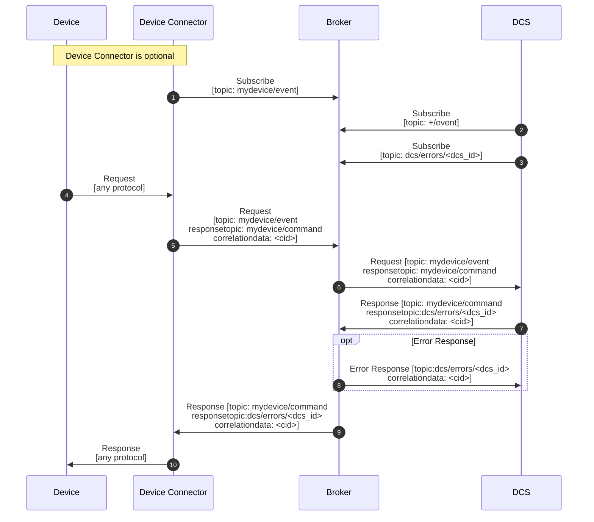
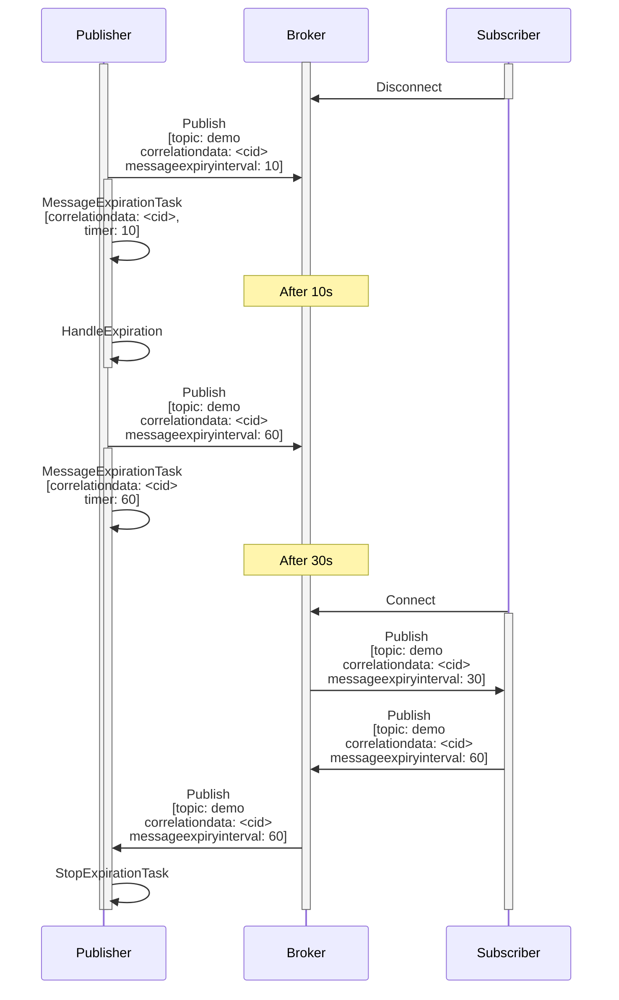

# Technical Standards

MicroDCS is built around open standards for messaging, payload modeling, observability, and industrial domain semantics. This page summarizes the main standards used by the framework and explains how they are applied in the current architecture.

## MQTT v5

MQTT v5 is the primary transport for event-driven communication in MicroDCS. The framework uses MQTT features not just for message delivery, but also for request-response flows, delivery coordination, scaling, and time-bounded processing.

Standard: [MQTT Version 5.0](https://docs.oasis-open.org/mqtt/mqtt/v5.0/mqtt-v5.0.html)

### [Request / Response](https://docs.oasis-open.org/mqtt/mqtt/v5.0/os/mqtt-v5.0-os.html#_Toc3901252)

MQTT v5 supports request-response interaction through `Response Topic` and `Correlation Data`. The `Request Response Information` and `Response Information` fields standardize the communication channel, but not the full response-handling behavior. In practice, brokers such as Mosquitto transport these attributes without managing the response flow for the application. MicroDCS therefore creates an instance-specific response channel and subscribes to it at startup to handle error and correlation backchannels. Published request-response messages are also expected to target topics with active subscribers, which corresponds to successful delivery with `PUBACK=0x00`.

### [Message Expiry Interval](https://www.emqx.com/en/blog/mqtt-message-expiry-interval)

MQTT v5 introduced `Message Expiry Interval` so publishers can set a bounded lifetime for time-sensitive messages. This helps reclaim control over message flow once a message is no longer useful. Depending on timing and broker behavior, the broker may discard the message before delivery, or the receiver may discard it after inspecting the remaining interval.

### [Shared Subscriptions](https://docs.oasis-open.org/mqtt/mqtt/v5.0/os/mqtt-v5.0-os.html#_Toc3901250)

To achieve higher availability or scale out processing across multiple container instances or MQTT clients, MicroDCS can use MQTT v5 shared subscriptions. A shared subscription is identified through a special topic-filter format: `$share/{ShareName}/{filter}`.

* `$share` is a literal string that marks the Topic Filter as being a Shared Subscription Topic Filter.
* `{ShareName}` is a character string that does not include "/", "+" or "#"
* `{filter}` The remainder of the string has the same syntax and semantics as a Topic Filter in a non-shared subscription.

With QoS 1, shared subscriptions provide load balancing so each message is delivered to one client in the shared group. They do not eliminate duplicate delivery, however. Publishers may resend when acknowledgments are missing, so consumers still need deduplication based on message identity or payload semantics.

### [Quality of Service](https://docs.oasis-open.org/mqtt/mqtt/v5.0/os/mqtt-v5.0-os.html#_Toc3901234)

The QoS level used to deliver an Application Message outbound to the Client could differ from that of the inbound Application Message.

Setting a response topic in the application sets QoS=1 (at least once delivery) where we want to make sure it arrives at the destination, otherwise its a QoS=0 (at most once delivery) notification that can be lost.

## MessagePack-RPC

MessagePack-RPC is supported as an additional transport option where a lightweight binary RPC channel is preferred.

* [MessagePack](https://msgpack.org/)
* [MessagePack-RPC specification](https://github.com/msgpack-rpc/msgpack-rpc/blob/master/spec.md)

## CloudEvents

CloudEvents provides the common event envelope used across transports. It allows MicroDCS to carry typed payloads, metadata, tracing information, and delivery attributes in a consistent way.

### Overview and Spec

* [CloudEvents primer: versioning of CloudEvents](https://github.com/cloudevents/spec/blob/v1.0.2/cloudevents/primer.md#versioning-of-cloudevents)
* [CloudEvents specification](https://github.com/cloudevents/spec/blob/v1.0.2/cloudevents/spec.md)
* [CloudEvents distributed tracing extension](https://github.com/cloudevents/spec/blob/v1.0.2/cloudevents/extensions/distributed-tracing.md)
* [CloudEvents expiry time extension](https://github.com/cloudevents/spec/blob/main/cloudevents/extensions/expirytime.md)
* [CloudEvents recorded time extension](https://github.com/cloudevents/spec/blob/main/cloudevents/extensions/recordedtime.md)
* [CloudEvents correlation extension](https://github.com/cloudevents/spec/blob/main/cloudevents/extensions/correlation.md)

### MQTT and MessagePack

CloudEvents defines an [MQTT binding](https://github.com/cloudevents/spec/blob/v1.0.2/cloudevents/bindings/mqtt-protocol-binding.md), which MicroDCS uses as the basis for transport mapping.

Because MicroDCS targets MQTT v5, it implements the binding in `Binary Content Mode`. `correlationid`, `expiryinterval`, and `datacontenttype` are mapped to the MQTT v5 properties `CorrelationData`, `MessageExpiryInterval`, and `ContentType`. Other MQTT-specific properties are read from and written to `transportmetadata`. CloudEvent attributes such as `id`, `source`, `subject`, `type`, and `dataschema`, along with entries in `custommetadata`, are transported through `UserProperty`.

For MessagePack transport, the CloudEvent is sent as a structured object, with `custommetadata` serialized into individual attributes. Transport-specific metadata is carried separately alongside the CloudEvent.

## JSON Schema

JSON Schema is used to define application payload models that can be turned into typed Python dataclasses.

* [JSON Schema](https://json-schema.org/)

## OpenTelemetry

OpenTelemetry provides the tracing and metrics foundation for runtime observability across handlers and processors.

* [OpenTelemetry Python zero-code instrumentation](https://opentelemetry.io/docs/zero-code/python/)
* [OpenTelemetry for Python](https://opentelemetry.io/docs/languages/python/)
* [OpenTelemetry messaging semantic conventions](https://opentelemetry.io/docs/specs/semconv/messaging/)
* [OpenTelemetry RPC semantic conventions](https://opentelemetry.io/docs/specs/semconv/rpc/)